# Everyday Prints — image index

All **47 print files and 6 reference assemblies**, with CAD previews.
[Searchable gallery](index.html) · [Printing guide](README.md) · [Download collection](everyday-prints.zip)

Dimensions are mm. Physical print testing remains pending. Click an image for the full-size CAD view.

## Organization and displays

| CAD preview | Model and files |
|---|---|
| [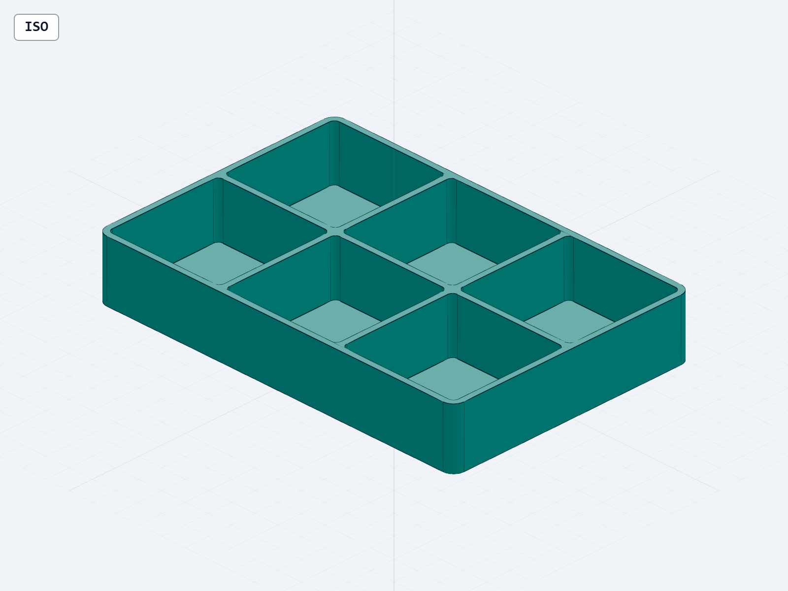](review/parts_tray_iso_20260930T001223Z.png) | **[Divided parts tray](index.html#parts_tray)** 150 × 100 × 24; six pockets [STL](parts_tray.stl) · [3MF](parts_tray.3mf) · [STEP](parts_tray.step) · [Source](parts_tray.step.py) [Opposite](review/parts_tray_opposite_20260930T001223Z.png) · [Top](review/parts_tray_top_20260930T001223Z.png) · [Front](review/parts_tray_front_20260930T001223Z.png) |
| [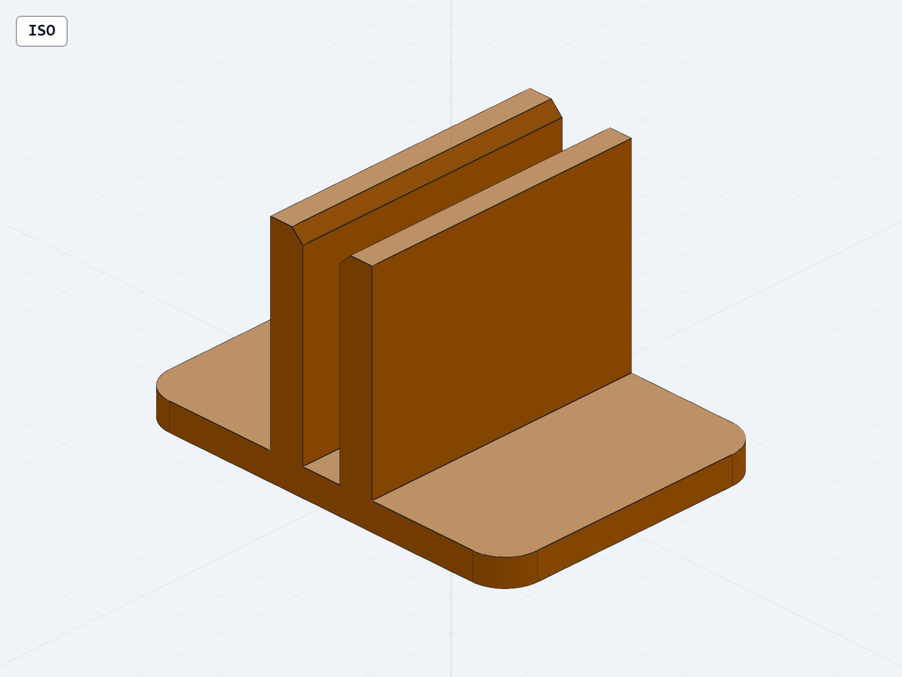](review/divider_foot_iso_20260930T001012Z.png) | **[Drawer-divider foot](index.html#divider_foot)** 34 × 24 × 20; 3.4 slot [STL](divider_foot.stl) · [3MF](divider_foot.3mf) · [STEP](divider_foot.step) · [Source](divider_foot.step.py) [Opposite](review/divider_foot_opposite_20260930T001012Z.png) · [Top](review/divider_foot_top_20260930T001012Z.png) · [Front](review/divider_foot_front_20260930T001012Z.png) |
| [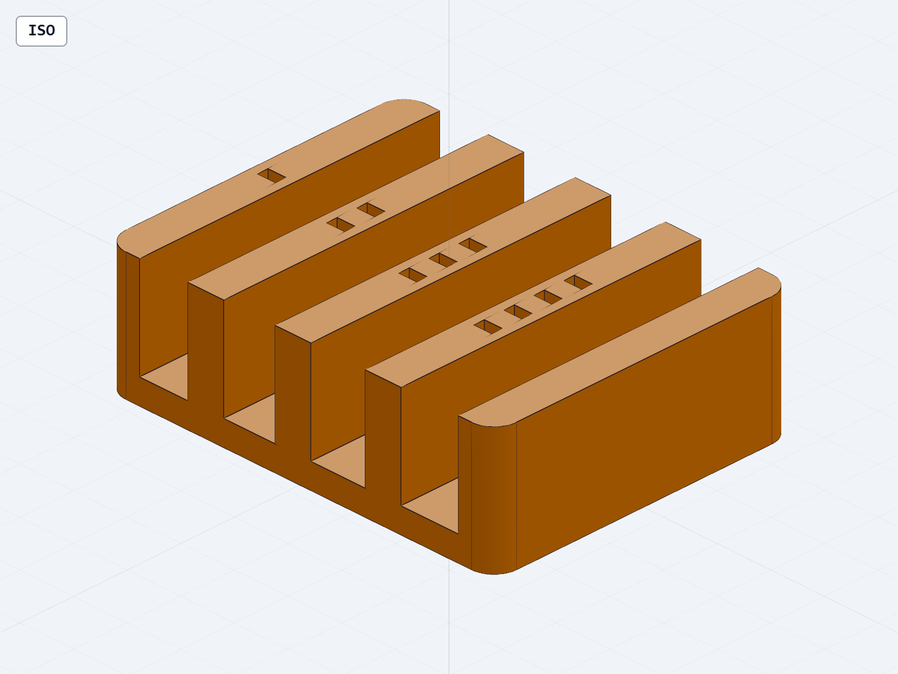](review/divider_fit_coupon_iso_20260930T001223Z.png) | **[Divider fit coupon](index.html#divider_fit_coupon)** 26 × 20 × 8; four slots [STL](divider_fit_coupon.stl) · [3MF](divider_fit_coupon.3mf) · [STEP](divider_fit_coupon.step) · [Source](divider_fit_coupon.step.py) [Opposite](review/divider_fit_coupon_opposite_20260930T001223Z.png) · [Top](review/divider_fit_coupon_top_20260930T001223Z.png) · [Front](review/divider_fit_coupon_front_20260930T001223Z.png) |
| [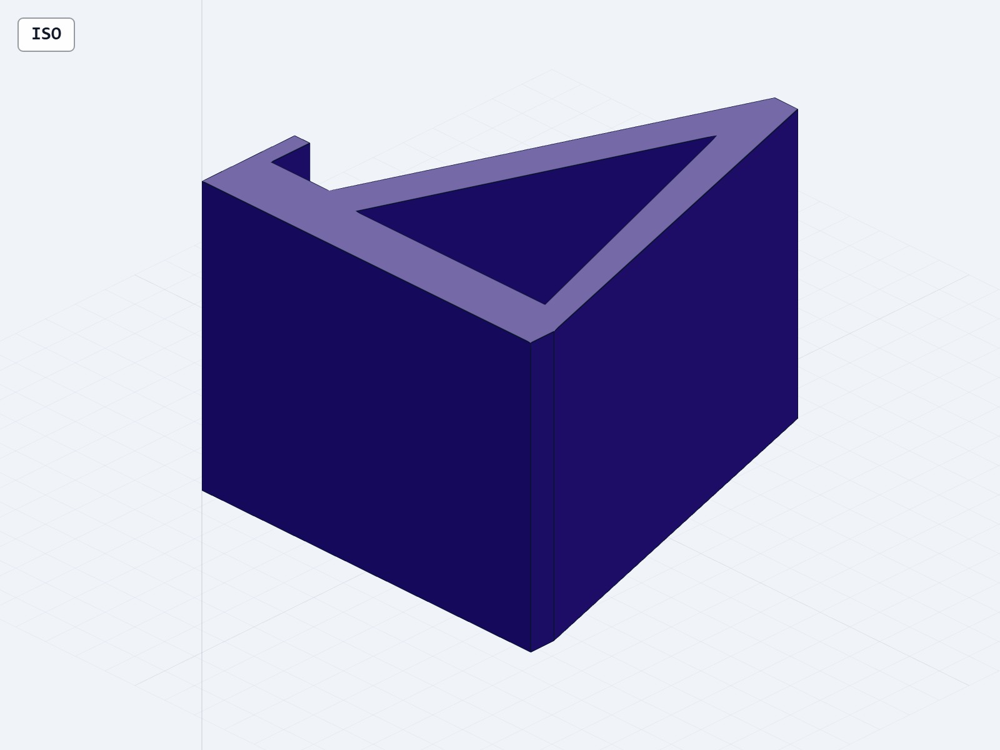](review/phone_stand_iso_20260930T001012Z.png) | **[Phone stand](index.html#phone_stand)** 85 × 96 × 65; prints on its side [STL](phone_stand.stl) · [3MF](phone_stand.3mf) · [STEP](phone_stand.step) · [Source](phone_stand.step.py) [Opposite](review/phone_stand_opposite_20260930T001012Z.png) · [Top](review/phone_stand_top_20260930T001012Z.png) · [Front](review/phone_stand_front_20260930T001012Z.png) |
| [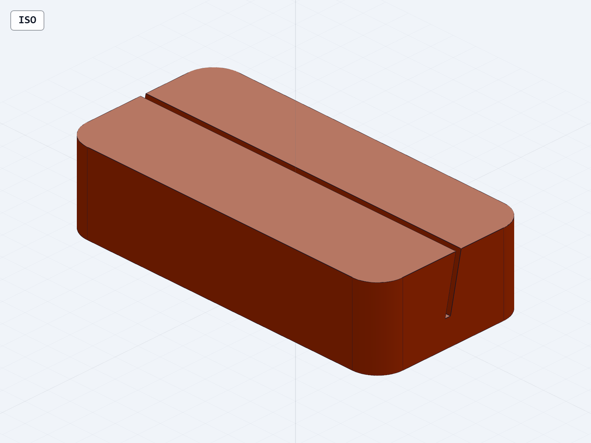](review/label_stand_iso_20260930T003528Z.png) | **[Leaning label stand](index.html#label_stand)** 50 × 24 × 12; 0.8 slot, 12° lean [STL](label_stand.stl) · [3MF](label_stand.3mf) · [STEP](label_stand.step) · [Source](label_stand.step.py) [Opposite](review/label_stand_opposite_20260930T003528Z.png) · [Top](review/label_stand_top_20260930T003528Z.png) · [Front](review/label_stand_front_20260930T003528Z.png) |
| [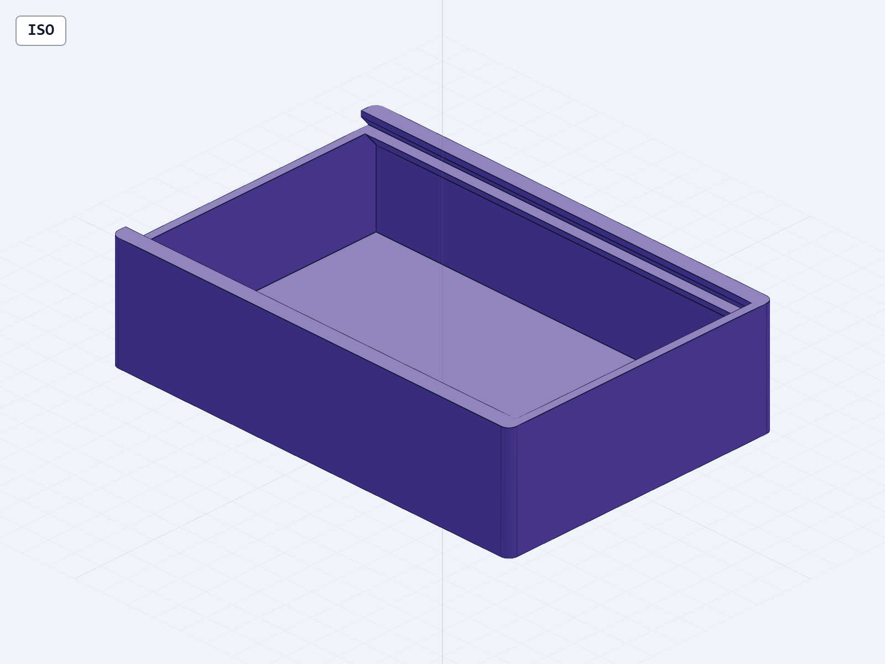](review/sliding_box_iso_20260930T011106Z.png) | **[Sliding-lid box](index.html#sliding_box)** 120 × 80 × 32; 2.4 floor and walls [STL](sliding_box.stl) · [3MF](sliding_box.3mf) · [STEP](sliding_box.step) · [Source](sliding_box.step.py) [Opposite](review/sliding_box_opposite_20260930T011106Z.png) · [Top](review/sliding_box_top_20260930T011106Z.png) · [Front](review/sliding_box_front_20260930T011106Z.png) |
| [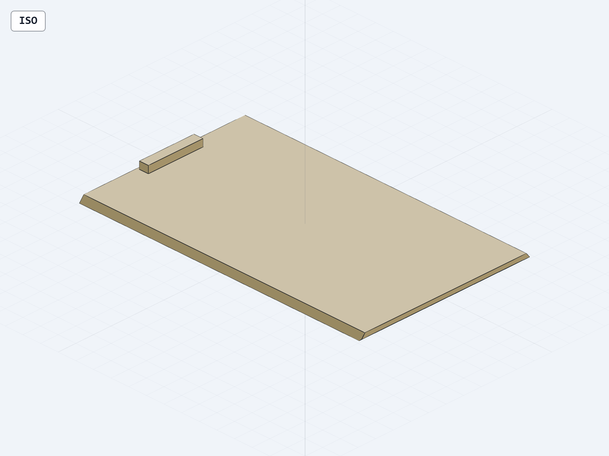](review/sliding_lid_iso_20260930T011106Z.png) | **[Sliding lid](index.html#sliding_lid)** 123.2 × 74.6 × 5.4 including pull grip [STL](sliding_lid.stl) · [3MF](sliding_lid.3mf) · [STEP](sliding_lid.step) · [Source](sliding_lid.step.py) [Opposite](review/sliding_lid_opposite_20260930T011106Z.png) · [Top](review/sliding_lid_top_20260930T011106Z.png) · [Front](review/sliding_lid_front_20260930T011106Z.png) |
| [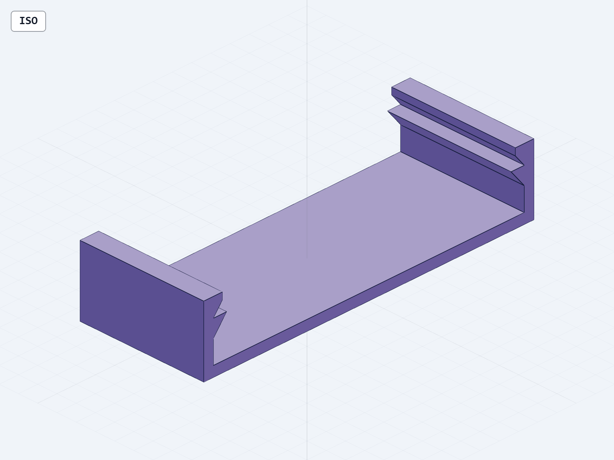](review/sliding_fit_channel_iso_20260930T011106Z.png) | **[Sliding fit channel](index.html#sliding_fit_channel)** 30 × 80 × 16; short rail sample [STL](sliding_fit_channel.stl) · [3MF](sliding_fit_channel.3mf) · [STEP](sliding_fit_channel.step) · [Source](sliding_fit_channel.step.py) [Opposite](review/sliding_fit_channel_opposite_20260930T011106Z.png) · [Top](review/sliding_fit_channel_top_20260930T011106Z.png) · [Front](review/sliding_fit_channel_front_20260930T011106Z.png) |
| [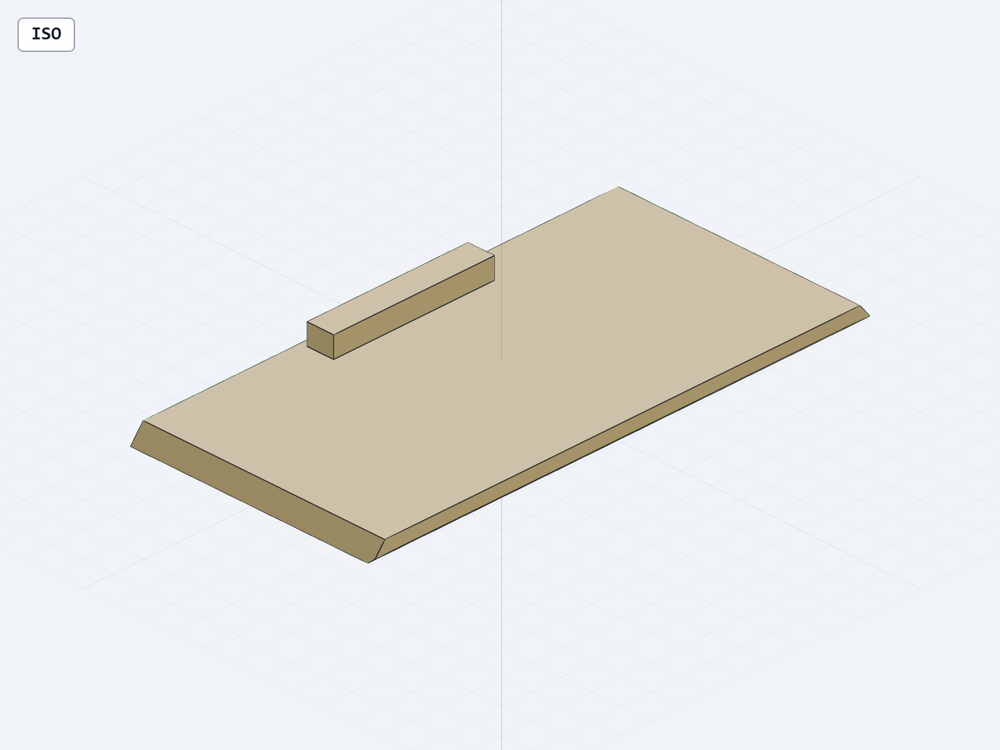](review/sliding_fit_slider_iso_20260930T011106Z.png) | **[Sliding fit slider](index.html#sliding_fit_slider)** 36 × 74.6 × 5.4; matching sample [STL](sliding_fit_slider.stl) · [3MF](sliding_fit_slider.3mf) · [STEP](sliding_fit_slider.step) · [Source](sliding_fit_slider.step.py) [Opposite](review/sliding_fit_slider_opposite_20260930T011106Z.png) · [Top](review/sliding_fit_slider_top_20260930T011106Z.png) · [Front](review/sliding_fit_slider_front_20260930T011106Z.png) |
| [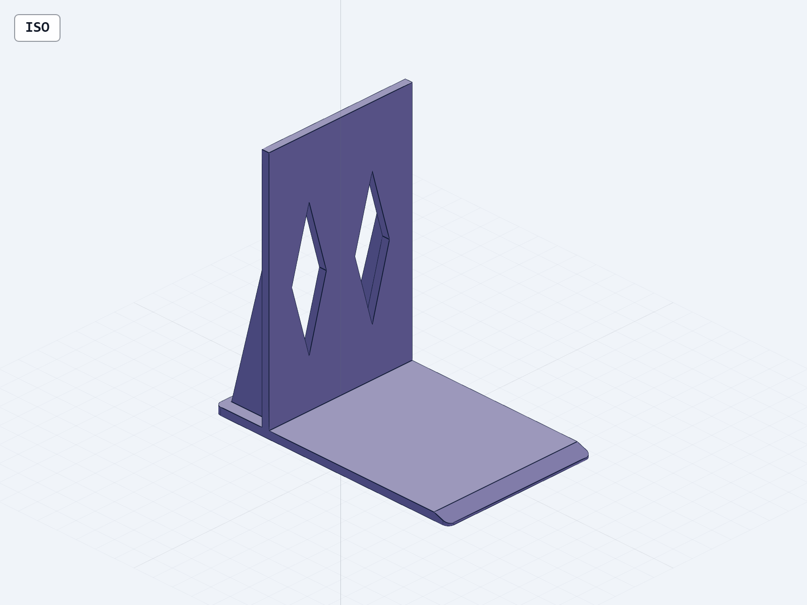](review/bookend_iso_20260930T025502Z.png) | **[Braced bookend](index.html#bookend)** 130 × 80 × 130; flat face and broad foot [STL](bookend.stl) · [3MF](bookend.3mf) · [STEP](bookend.step) · [Source](bookend.step.py) [Opposite](review/bookend_opposite_20260930T025502Z.png) · [Top](review/bookend_top_20260930T025502Z.png) · [Front](review/bookend_front_20260930T025502Z.png) |
| [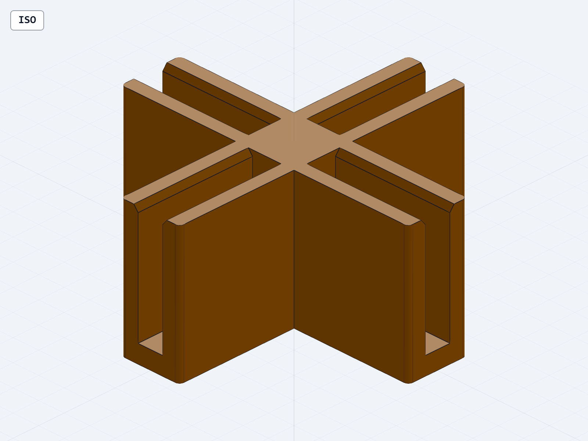](review/divider_joint_iso_20261001T005829Z.png) | **[Modular divider joint](index.html#divider_joint)** 40.2 × 40.2 × 18; selectable cross, T, corner, straight [STL](divider_joint.stl) · [3MF](divider_joint.3mf) · [STEP](divider_joint.step) · [Source](divider_joint.step.py) [Opposite](review/divider_joint_opposite_20261001T005829Z.png) · [Top](review/divider_joint_top_20261001T005829Z.png) · [Front](review/divider_joint_front_20261001T005829Z.png) |

## Cable handling, clips, and hardware

| CAD preview | Model and files |
|---|---|
| [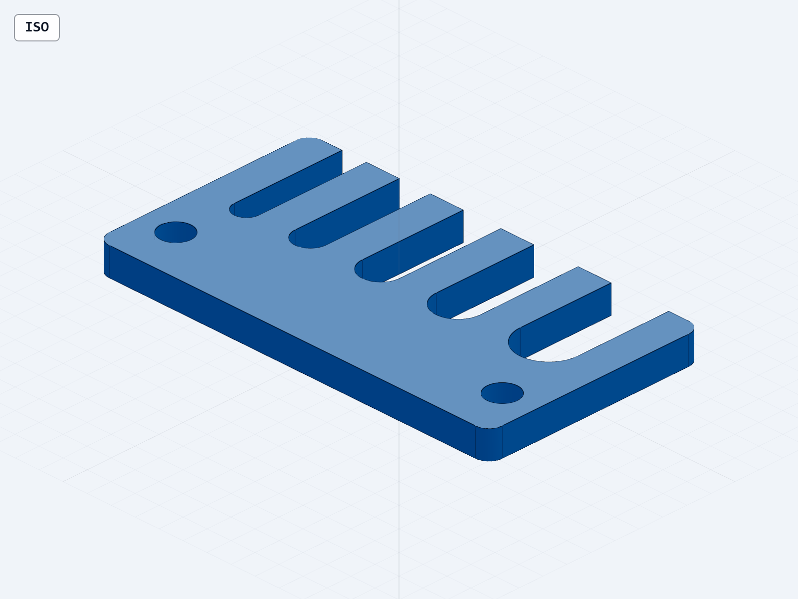](review/cable_comb_iso_20260930T001012Z.png) | **[Desk-edge cable comb](index.html#cable_comb)** 59 × 32 × 4; five slots [STL](cable_comb.stl) · [3MF](cable_comb.3mf) · [STEP](cable_comb.step) · [Source](cable_comb.step.py) [Opposite](review/cable_comb_opposite_20260930T001012Z.png) · [Top](review/cable_comb_top_20260930T001012Z.png) · [Front](review/cable_comb_front_20260930T001012Z.png) |
| [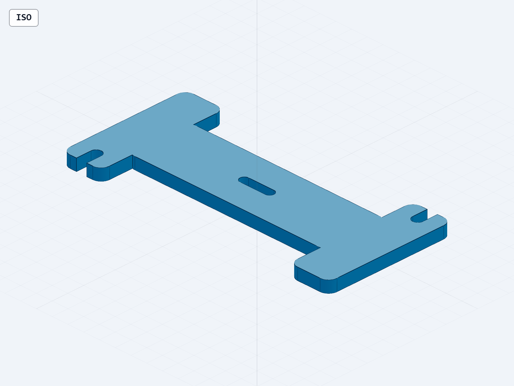](review/cable_winder_iso_20260930T003528Z.png) | **[Cord winder](index.html#cable_winder)** 95 × 44 × 4; 22 wide waist [STL](cable_winder.stl) · [3MF](cable_winder.3mf) · [STEP](cable_winder.step) · [Source](cable_winder.step.py) [Opposite](review/cable_winder_opposite_20260930T003528Z.png) · [Top](review/cable_winder_top_20260930T003528Z.png) · [Front](review/cable_winder_front_20260930T003528Z.png) |
| [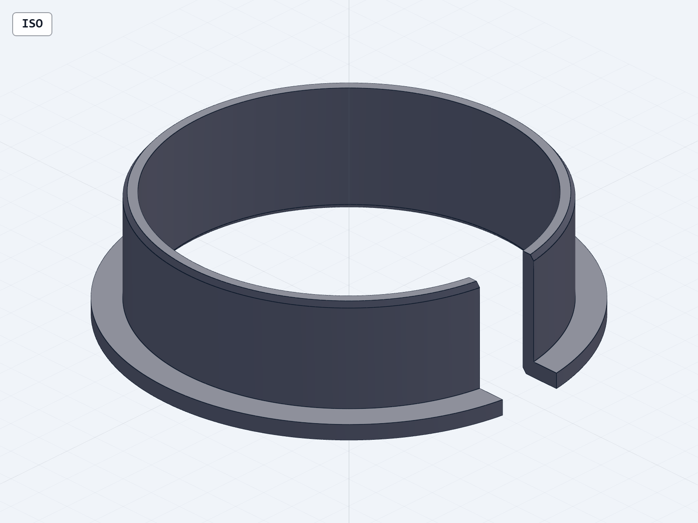](review/cable_grommet_iso_20260930T005110Z.png) | **[Desk cable grommet](index.html#cable_grommet)** 68 flange diameter × 18.4 high; 60 nominal opening [STL](cable_grommet.stl) · [3MF](cable_grommet.3mf) · [STEP](cable_grommet.step) · [Source](cable_grommet.step.py) [Opposite](review/cable_grommet_opposite_20260930T005110Z.png) · [Top](review/cable_grommet_top_20260930T005110Z.png) · [Front](review/cable_grommet_front_20260930T005110Z.png) |
| [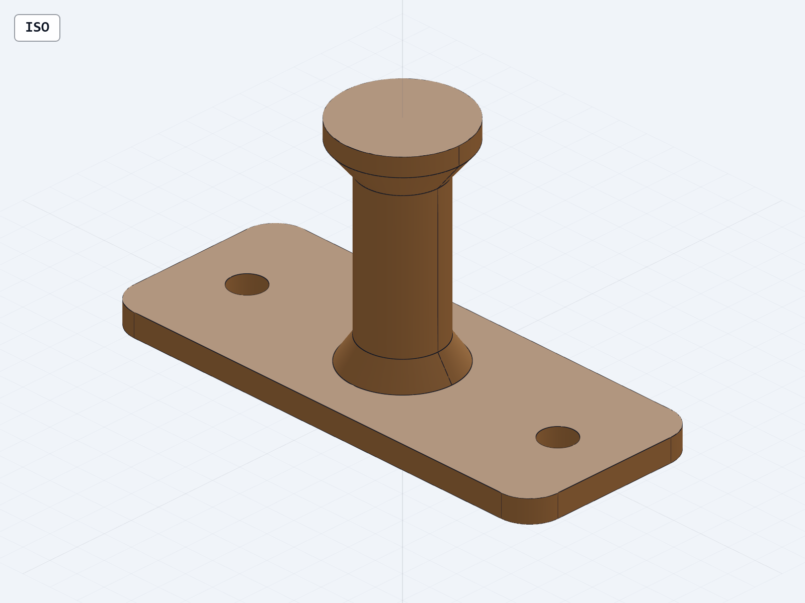](review/utility_peg_iso_20260930T010302Z.png) | **[Utility peg](index.html#utility_peg)** 60 × 24 × 31; 10 stem, 16 retaining head [STL](utility_peg.stl) · [3MF](utility_peg.3mf) · [STEP](utility_peg.step) · [Source](utility_peg.step.py) [Opposite](review/utility_peg_opposite_20260930T010302Z.png) · [Top](review/utility_peg_top_20260930T010302Z.png) · [Front](review/utility_peg_front_20260930T010302Z.png) |
| [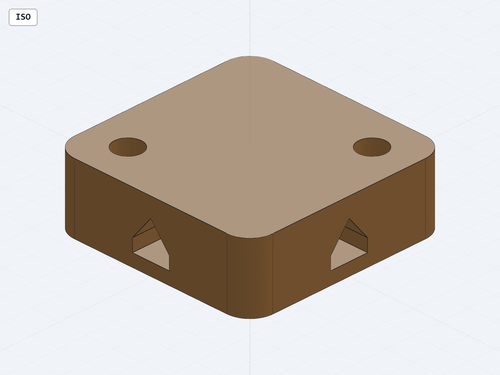](review/tie_anchor_iso_20260930T020904Z.png) | **[Cable-tie anchor](index.html#tie_anchor)** 26 × 26 × 8.6; two threading directions [STL](tie_anchor.stl) · [3MF](tie_anchor.3mf) · [STEP](tie_anchor.step) · [Source](tie_anchor.step.py) [Opposite](review/tie_anchor_opposite_20260930T020904Z.png) · [Top](review/tie_anchor_top_20260930T020904Z.png) · [Front](review/tie_anchor_front_20260930T020904Z.png) |
| [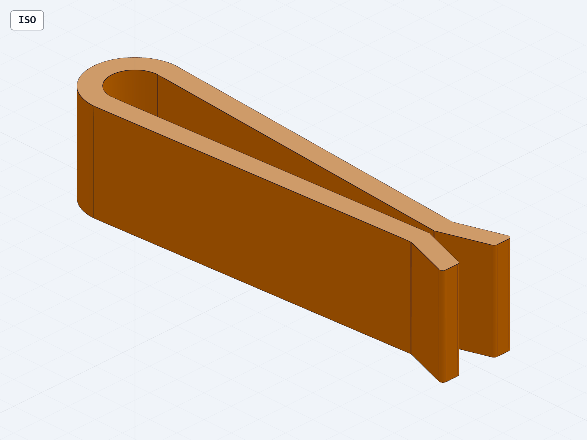](review/fold_clip_iso_20260930T023047Z.png) | **[Folded-bag clip — flexure trial](index.html#fold_clip)** 50.4 × 10.8 × 12; 0.609 rounded throat [STL](fold_clip.stl) · [3MF](fold_clip.3mf) · [STEP](fold_clip.step) · [Source](fold_clip.step.py) [Opposite](review/fold_clip_opposite_20260930T023047Z.png) · [Top](review/fold_clip_top_20260930T023047Z.png) · [Front](review/fold_clip_front_20260930T023047Z.png) |
| [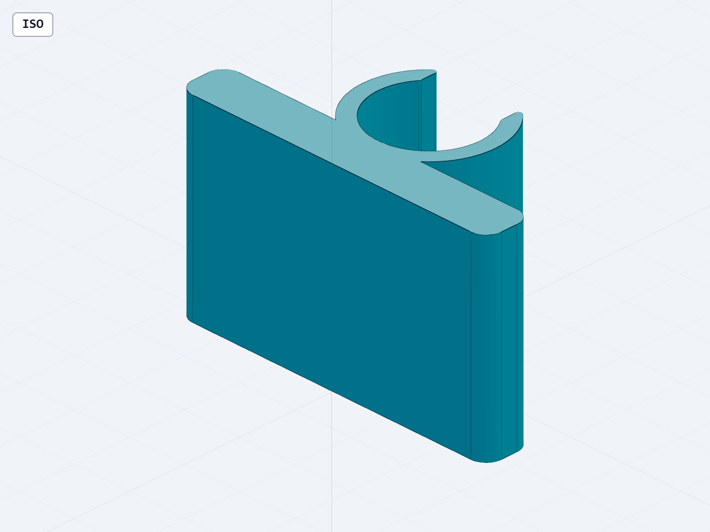](review/cord_clip_iso_20260930T023047Z.png) | **[Cord clip — flexure trial](index.html#cord_clip)** 20 × 9.495 × 12; 6.6 cavity, 5.2 entry [STL](cord_clip.stl) · [3MF](cord_clip.3mf) · [STEP](cord_clip.step) · [Source](cord_clip.step.py) [Opposite](review/cord_clip_opposite_20260930T023047Z.png) · [Top](review/cord_clip_top_20260930T023047Z.png) · [Front](review/cord_clip_front_20260930T023047Z.png) |
| [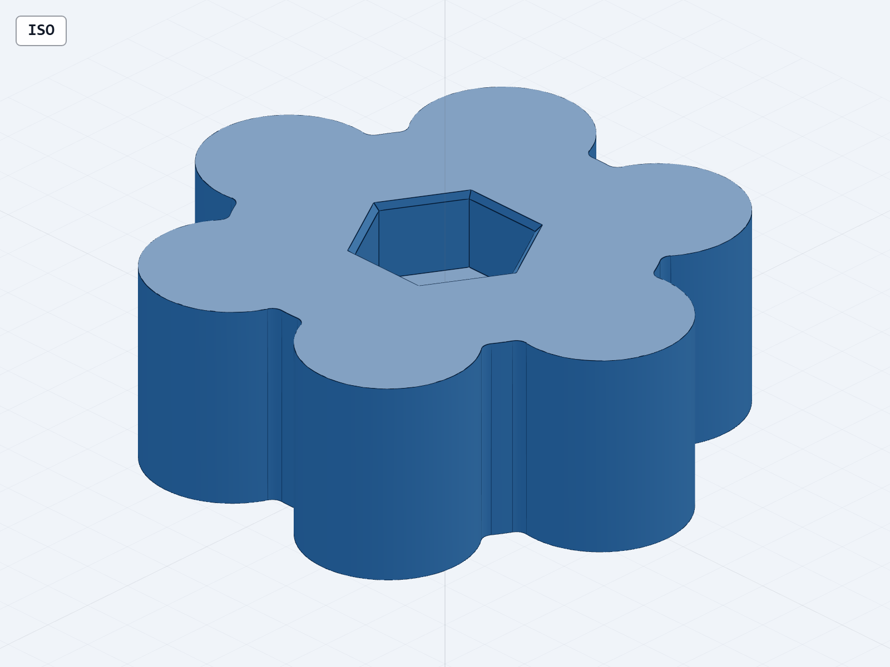](review/hand_knob_iso_20260930T023857Z.png) | **[Hex-nut hand knob](index.html#hand_knob)** 40 × 36.249 × 14; six rounded lobes [STL](hand_knob.stl) · [3MF](hand_knob.3mf) · [STEP](hand_knob.step) · [Source](hand_knob.step.py) [Opposite](review/hand_knob_opposite_20260930T023857Z.png) · [Top](review/hand_knob_top_20260930T023857Z.png) · [Front](review/hand_knob_front_20260930T023857Z.png) |
| [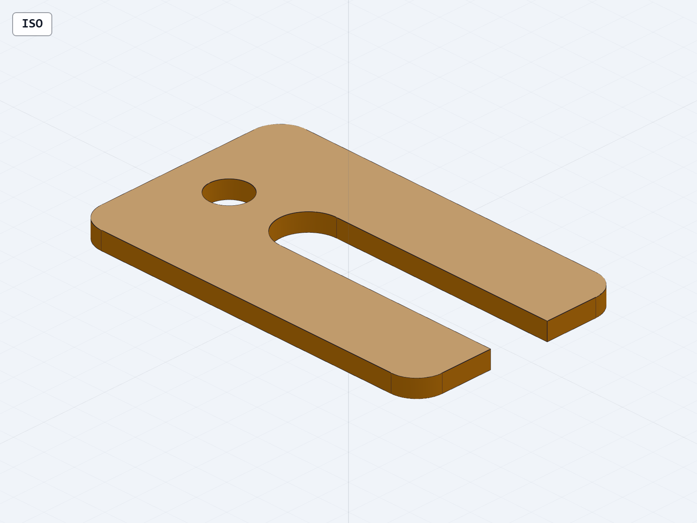](review/slotted_shim_iso_20260930T023857Z.png) | **[Slotted spacing shim](index.html#slotted_shim)** 40 × 24 × 2; 6.6 wide open slot [STL](slotted_shim.stl) · [3MF](slotted_shim.3mf) · [STEP](slotted_shim.step) · [Source](slotted_shim.step.py) [Opposite](review/slotted_shim_opposite_20260930T023857Z.png) · [Top](review/slotted_shim_top_20260930T023857Z.png) · [Front](review/slotted_shim_front_20260930T023857Z.png) |
| [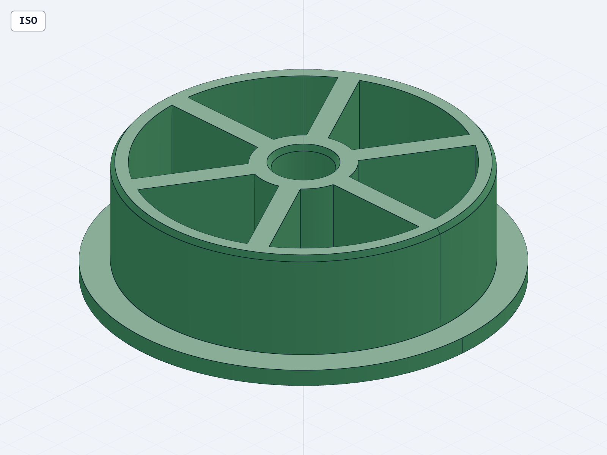](review/roll_adapter_iso_20260930T024628Z.png) | **[Roll-core adapter — print two](index.html#roll_adapter)** 60 flange diameter × 17.4 high; 8.6 axle bore [STL](roll_adapter.stl) · [3MF](roll_adapter.3mf) · [STEP](roll_adapter.step) · [Source](roll_adapter.step.py) [Opposite](review/roll_adapter_opposite_20260930T024628Z.png) · [Top](review/roll_adapter_top_20260930T024628Z.png) · [Front](review/roll_adapter_front_20260930T024628Z.png) |
| [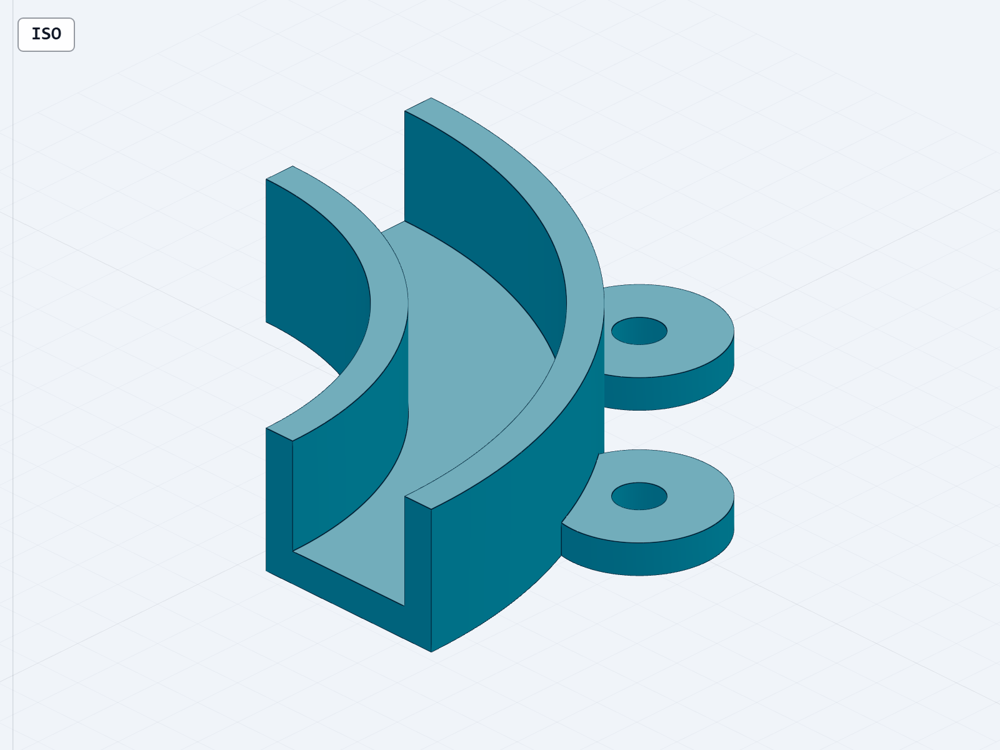](review/corner_cable_guide_iso_20260930T025502Z.png) | **[Corner cable guide](index.html#corner_cable_guide)** 41.507 × 41.507 × 10.4; 10 wide curved channel [STL](corner_cable_guide.stl) · [3MF](corner_cable_guide.3mf) · [STEP](corner_cable_guide.step) · [Source](corner_cable_guide.step.py) [Opposite](review/corner_cable_guide_opposite_20260930T025502Z.png) · [Top](review/corner_cable_guide_top_20260930T025502Z.png) · [Front](review/corner_cable_guide_front_20260930T025502Z.png) |

## Workshop layout aids

| CAD preview | Model and files |
|---|---|
| [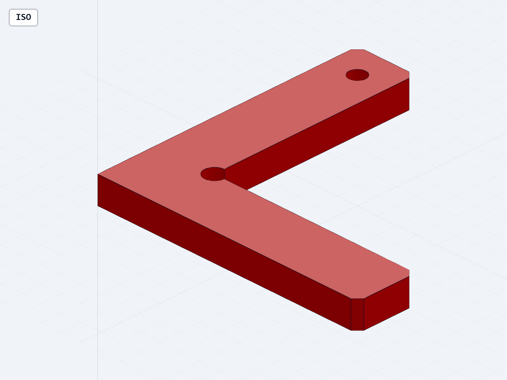](review/corner_square_iso_20260930T001012Z.png) | **[Corner square](index.html#corner_square)** 80 × 80 × 8; 18 wide legs [STL](corner_square.stl) · [3MF](corner_square.3mf) · [STEP](corner_square.step) · [Source](corner_square.step.py) [Opposite](review/corner_square_opposite_20260930T001012Z.png) · [Top](review/corner_square_top_20260930T001012Z.png) · [Front](review/corner_square_front_20260930T001012Z.png) |
| [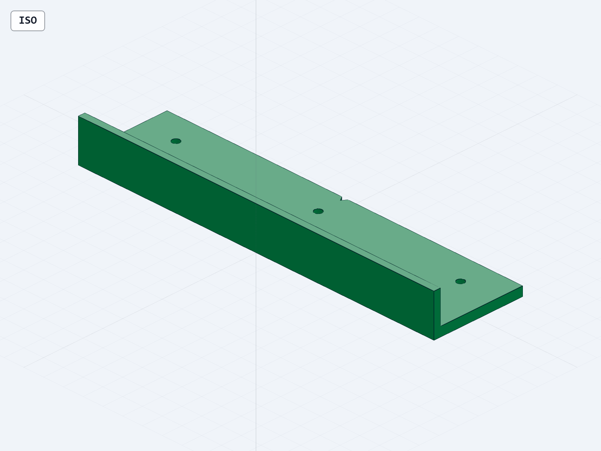](review/handle_marking_jig_iso_20260930T001012Z.png) | **[Handle marking jig](index.html#handle_marking_jig)** 160 × 40 × 18; 128 hole pitch [STL](handle_marking_jig.stl) · [3MF](handle_marking_jig.3mf) · [STEP](handle_marking_jig.step) · [Source](handle_marking_jig.step.py) [Opposite](review/handle_marking_jig_opposite_20260930T001012Z.png) · [Top](review/handle_marking_jig_top_20260930T001012Z.png) · [Front](review/handle_marking_jig_front_20260930T001012Z.png) |
| [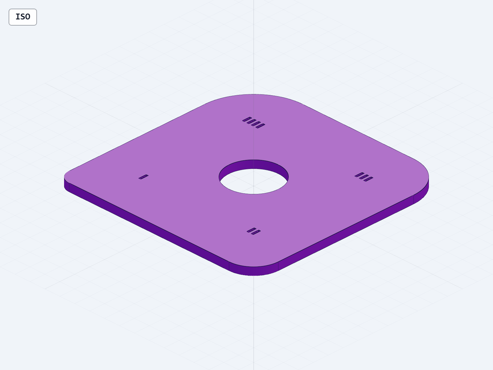](review/radius_template_iso_20260930T005110Z.png) | **[Corner-radius template](index.html#radius_template)** 80 × 80 × 3; radii 5, 10, 15, 20 [STL](radius_template.stl) · [3MF](radius_template.3mf) · [STEP](radius_template.step) · [Source](radius_template.step.py) [Opposite](review/radius_template_opposite_20260930T005110Z.png) · [Top](review/radius_template_top_20260930T005110Z.png) · [Front](review/radius_template_front_20260930T005110Z.png) |
| [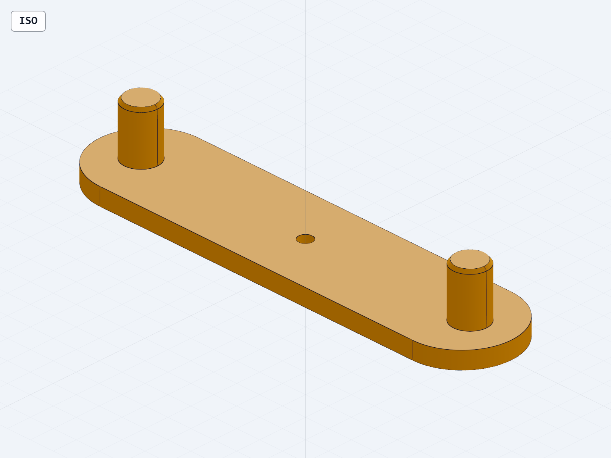](review/center_finder_iso_20260930T010132Z.png) | **[Center-finding jig](index.html#center_finder)** 100 × 24 × 16; 72 maximum stock width [STL](center_finder.stl) · [3MF](center_finder.3mf) · [STEP](center_finder.step) · [Source](center_finder.step.py) [Opposite](review/center_finder_opposite_20260930T010132Z.png) · [Top](review/center_finder_top_20260930T010132Z.png) · [Front](review/center_finder_front_20260930T010132Z.png) |
| [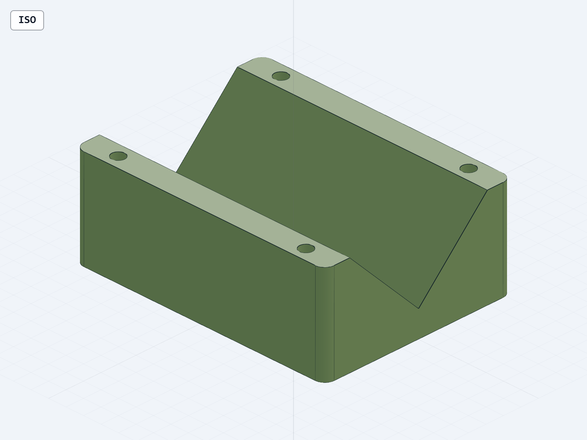](review/round_stock_cradle_iso_20260930T020904Z.png) | **[Round-stock cradle](index.html#round_stock_cradle)** 80 × 60 × 30; 90° V groove [STL](round_stock_cradle.stl) · [3MF](round_stock_cradle.3mf) · [STEP](round_stock_cradle.step) · [Source](round_stock_cradle.step.py) [Opposite](review/round_stock_cradle_opposite_20260930T020904Z.png) · [Top](review/round_stock_cradle_top_20260930T020904Z.png) · [Front](review/round_stock_cradle_front_20260930T020904Z.png) |
| [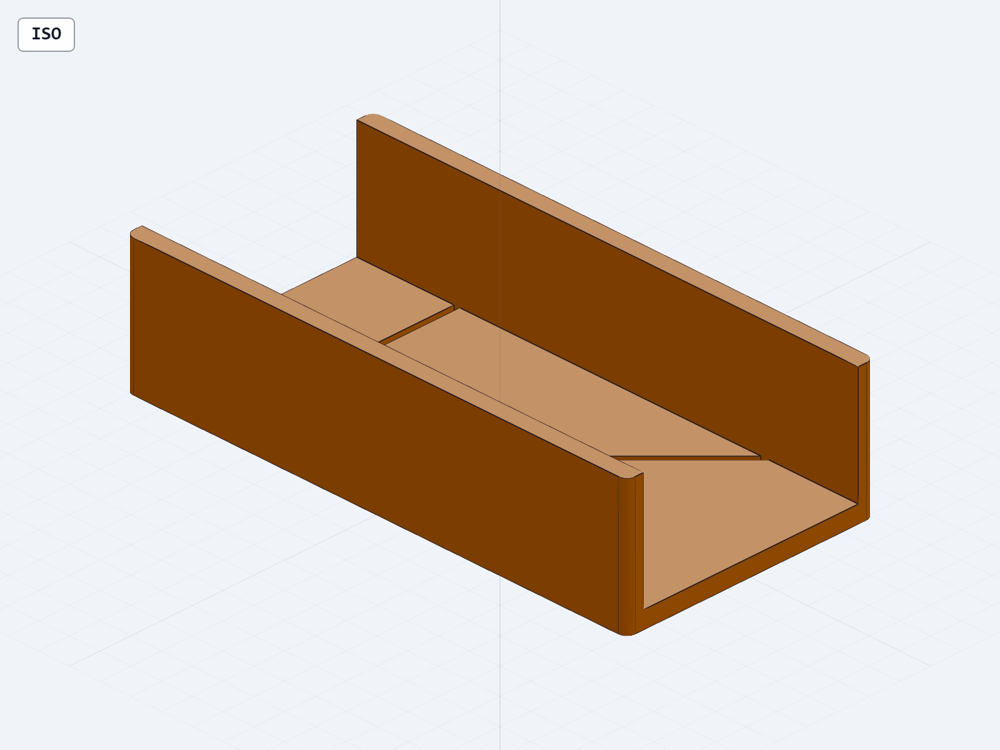](review/marking_saddle_iso_20260930T024628Z.png) | **[90°/45° marking saddle](index.html#marking_saddle)** 90 × 44.5 × 23; for a measured 38 wide board [STL](marking_saddle.stl) · [3MF](marking_saddle.3mf) · [STEP](marking_saddle.step) · [Source](marking_saddle.step.py) [Opposite](review/marking_saddle_opposite_20260930T024628Z.png) · [Top](review/marking_saddle_top_20260930T024628Z.png) · [Front](review/marking_saddle_front_20260930T024628Z.png) |
| [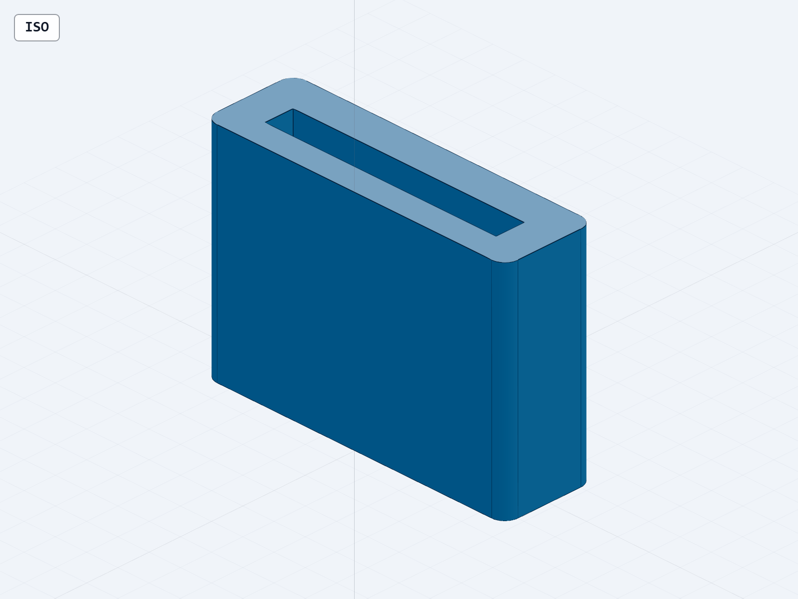](review/ruler_stop_iso_20260930T031538Z.png) | **[Adjustable ruler-stop body](index.html#ruler_stop)** 34.4 × 10.2 × 24; prints on an end profile [STL](ruler_stop.stl) · [3MF](ruler_stop.3mf) · [STEP](ruler_stop.step) · [Source](ruler_stop.step.py) [Opposite](review/ruler_stop_opposite_20260930T031538Z.png) · [Top](review/ruler_stop_top_20260930T031538Z.png) · [Front](review/ruler_stop_front_20260930T031538Z.png) |
| [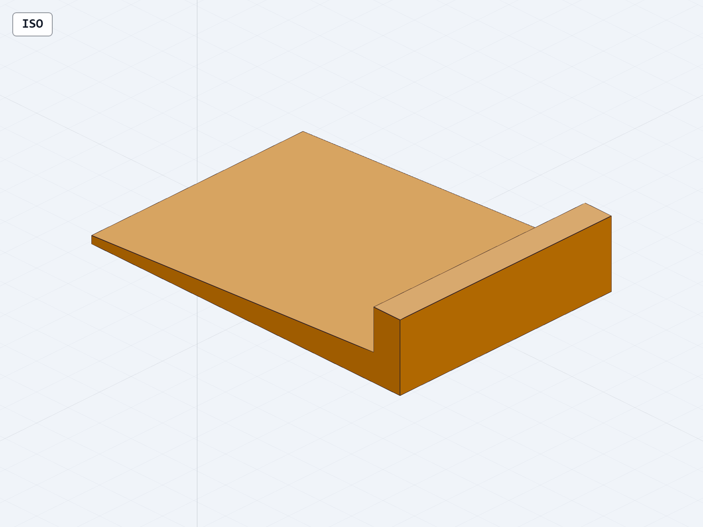](review/ruler_wedge_iso_20260930T031538Z.png) | **[Ruler-stop wedge](index.html#ruler_wedge)** 35 × 24 × 7 including pull grip [STL](ruler_wedge.stl) · [3MF](ruler_wedge.3mf) · [STEP](ruler_wedge.step) · [Source](ruler_wedge.step.py) [Opposite](review/ruler_wedge_opposite_20260930T031538Z.png) · [Top](review/ruler_wedge_top_20260930T031538Z.png) · [Front](review/ruler_wedge_front_20260930T031538Z.png) |

## Household use and labeling

| CAD preview | Model and files |
|---|---|
| [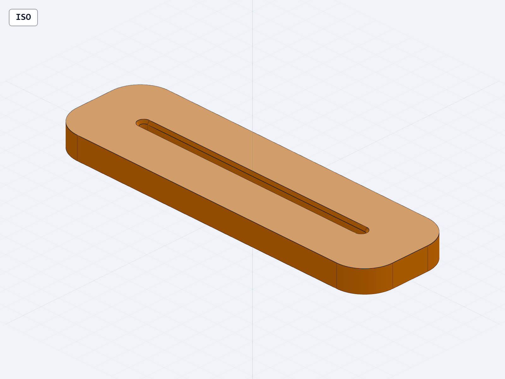](review/tube_squeezer_iso_20260930T002514Z.png) | **[Tube squeezer](index.html#tube_squeezer)** 90 × 26 × 6; 64 × 2 working slot [STL](tube_squeezer.stl) · [3MF](tube_squeezer.3mf) · [STEP](tube_squeezer.step) · [Source](tube_squeezer.step.py) [Opposite](review/tube_squeezer_opposite_20260930T002514Z.png) · [Top](review/tube_squeezer_top_20260930T002514Z.png) · [Front](review/tube_squeezer_front_20260930T002514Z.png) |
| [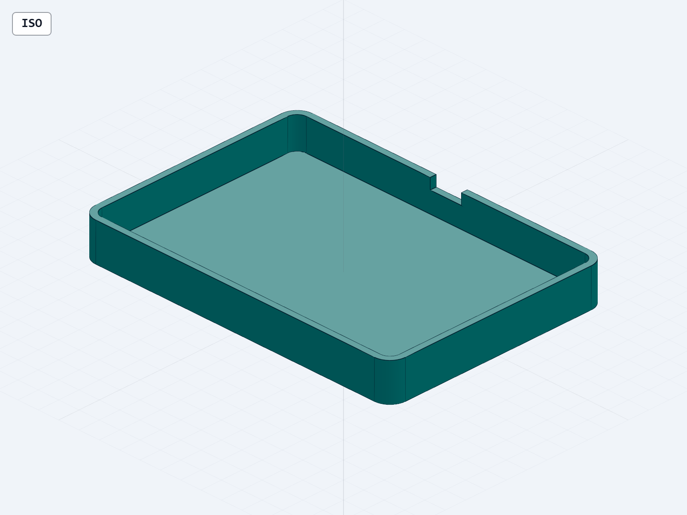](review/soap_dish_tray_iso_20260930T001900Z.png) | **[Soap-dish catch tray](index.html#soap_dish_tray)** 120 × 84 × 14 [STL](soap_dish_tray.stl) · [3MF](soap_dish_tray.3mf) · [STEP](soap_dish_tray.step) · [Source](soap_dish_tray.step.py) [Opposite](review/soap_dish_tray_opposite_20260930T001900Z.png) · [Top](review/soap_dish_tray_top_20260930T001900Z.png) · [Front](review/soap_dish_tray_front_20260930T001900Z.png) |
| [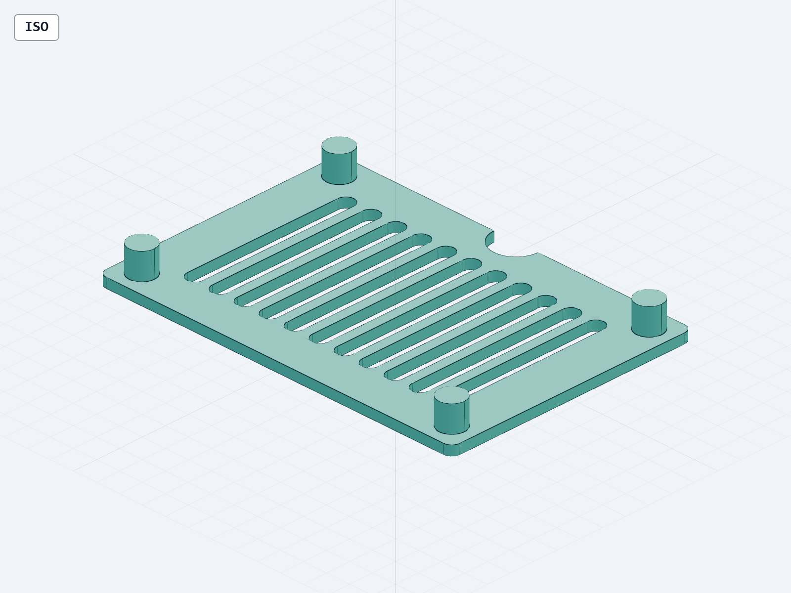](review/soap_dish_insert_iso_20260930T001900Z.png) | **[Soap-dish draining insert](index.html#soap_dish_insert)** 113.2 × 77.2 × 11; feet print upward [STL](soap_dish_insert.stl) · [3MF](soap_dish_insert.3mf) · [STEP](soap_dish_insert.step) · [Source](soap_dish_insert.step.py) [Opposite](review/soap_dish_insert_opposite_20260930T001900Z.png) · [Top](review/soap_dish_insert_top_20260930T001900Z.png) · [Front](review/soap_dish_insert_front_20260930T001900Z.png) |
| [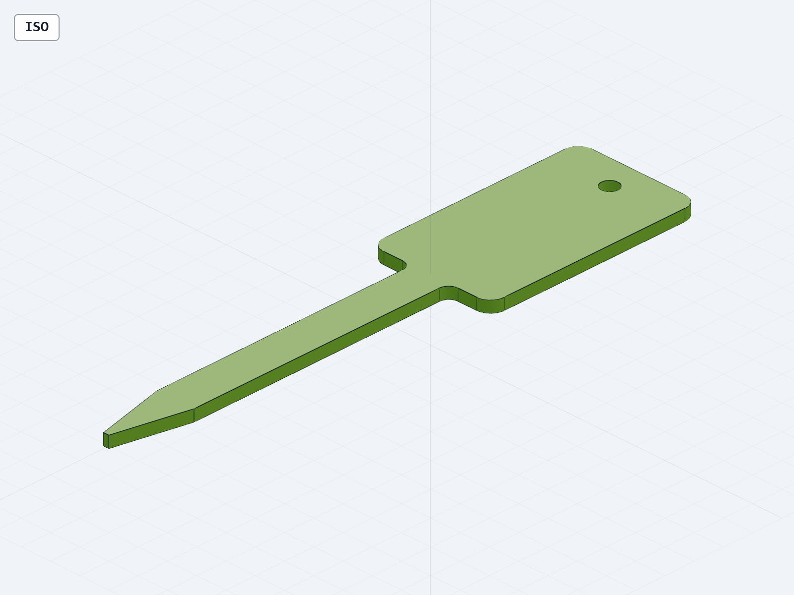](review/plant_marker_iso_20260930T030345Z.png) | **[Blank plant marker](index.html#plant_marker)** 26 × 115 × 2.4; 70 long stake [STL](plant_marker.stl) · [3MF](plant_marker.3mf) · [STEP](plant_marker.step) · [Source](plant_marker.step.py) [Opposite](review/plant_marker_opposite_20260930T030345Z.png) · [Top](review/plant_marker_top_20260930T030345Z.png) · [Front](review/plant_marker_front_20260930T030345Z.png) |

## Workshop handling, finishing, and sorting

| CAD preview | Model and files |
|---|---|
| [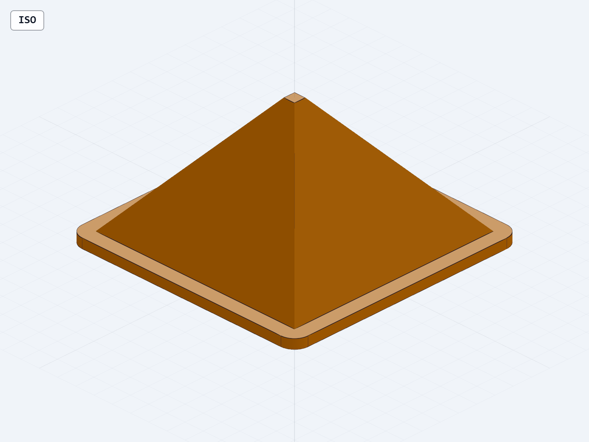](review/paint_pyramid_iso_20260930T003528Z.png) | **[Finishing pyramid](index.html#paint_pyramid)** 50 × 50 × 26; 2.4 square contact tip [STL](paint_pyramid.stl) · [3MF](paint_pyramid.3mf) · [STEP](paint_pyramid.step) · [Source](paint_pyramid.step.py) [Opposite](review/paint_pyramid_opposite_20260930T003528Z.png) · [Top](review/paint_pyramid_top_20260930T003528Z.png) · [Front](review/paint_pyramid_front_20260930T003528Z.png) |
| [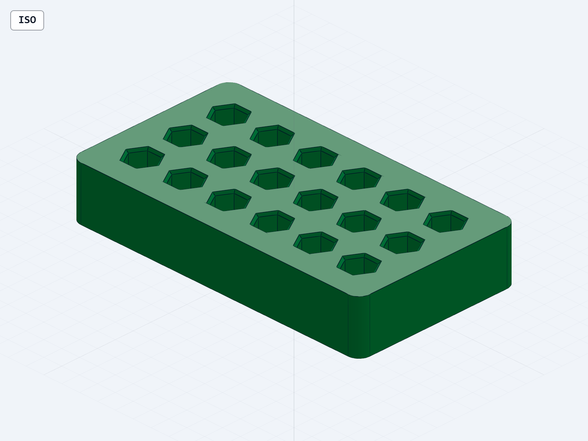](review/hex_bit_rack_iso_20260930T003528Z.png) | **[Hex-bit rack](index.html#hex_bit_rack)** 80 × 44 × 14; eighteen 6.7 hex sockets [STL](hex_bit_rack.stl) · [3MF](hex_bit_rack.3mf) · [STEP](hex_bit_rack.step) · [Source](hex_bit_rack.step.py) [Opposite](review/hex_bit_rack_opposite_20260930T003528Z.png) · [Top](review/hex_bit_rack_top_20260930T003528Z.png) · [Front](review/hex_bit_rack_front_20260930T003528Z.png) |
| [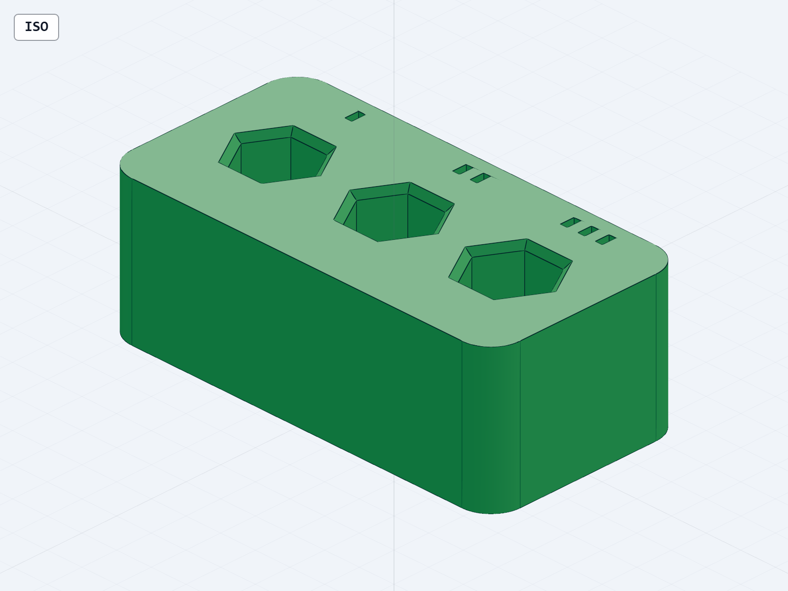](review/hex_bit_fit_coupon_iso_20260930T004245Z.png) | **[Hex-bit fit coupon](index.html#hex_bit_fit_coupon)** 40 × 20 × 14; three trial sockets [STL](hex_bit_fit_coupon.stl) · [3MF](hex_bit_fit_coupon.3mf) · [STEP](hex_bit_fit_coupon.step) · [Source](hex_bit_fit_coupon.step.py) [Opposite](review/hex_bit_fit_coupon_opposite_20260930T004245Z.png) · [Top](review/hex_bit_fit_coupon_top_20260930T004245Z.png) · [Front](review/hex_bit_fit_coupon_front_20260930T004245Z.png) |
| [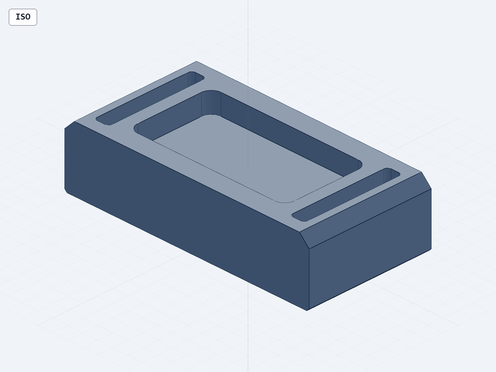](review/sanding_block_iso_20260930T005110Z.png) | **[Hand sanding block](index.html#sanding_block)** 100 × 50 × 25; two paper-clamp slots [STL](sanding_block.stl) · [3MF](sanding_block.3mf) · [STEP](sanding_block.step) · [Source](sanding_block.step.py) [Opposite](review/sanding_block_opposite_20260930T005110Z.png) · [Top](review/sanding_block_top_20260930T005110Z.png) · [Front](review/sanding_block_front_20260930T005110Z.png) |
| [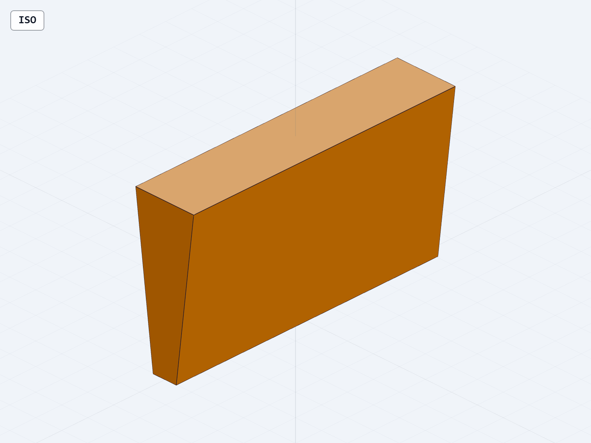](review/sanding_wedge_iso_20260930T005110Z.png) | **[Sanding wedge — print two](index.html#sanding_wedge)** 8 × 36 × 20; narrow tip down [STL](sanding_wedge.stl) · [3MF](sanding_wedge.3mf) · [STEP](sanding_wedge.step) · [Source](sanding_wedge.step.py) [Opposite](review/sanding_wedge_opposite_20260930T005110Z.png) · [Top](review/sanding_wedge_top_20260930T005110Z.png) · [Front](review/sanding_wedge_front_20260930T005110Z.png) |
| [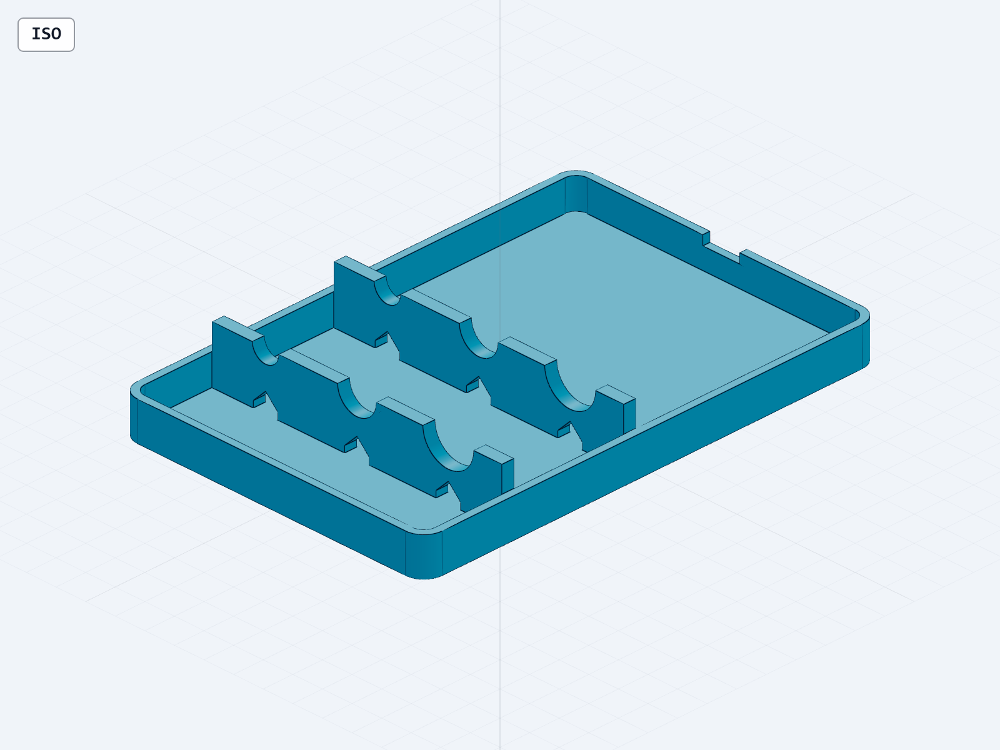](review/brush_rest_iso_20260930T010132Z.png) | **[Brush rest and catch tray](index.html#brush_rest)** 100 × 150 × 20; three paired cradles [STL](brush_rest.stl) · [3MF](brush_rest.3mf) · [STEP](brush_rest.step) · [Source](brush_rest.step.py) [Opposite](review/brush_rest_opposite_20260930T010132Z.png) · [Top](review/brush_rest_top_20260930T010132Z.png) · [Front](review/brush_rest_front_20260930T010132Z.png) |
| [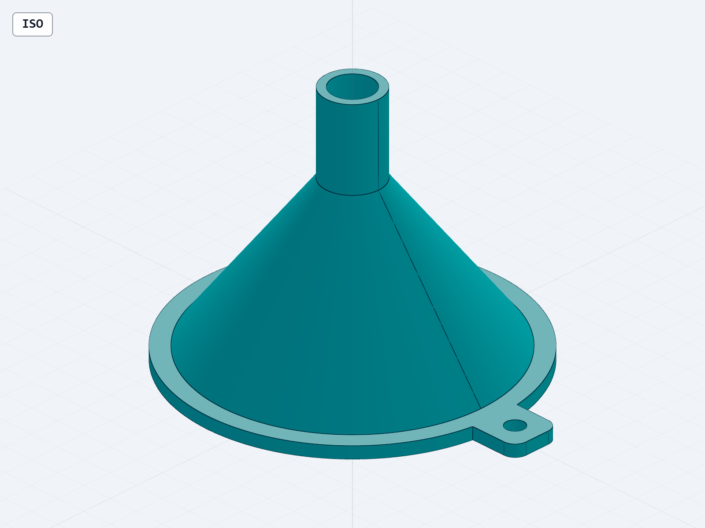](review/workshop_funnel_iso_20260930T020904Z.png) | **[Workshop funnel](index.html#workshop_funnel)** 70 mouth, 10 spout bore; 60 high [STL](workshop_funnel.stl) · [3MF](workshop_funnel.3mf) · [STEP](workshop_funnel.step) · [Source](workshop_funnel.step.py) [Opposite](review/workshop_funnel_opposite_20260930T020904Z.png) · [Top](review/workshop_funnel_top_20260930T020904Z.png) · [Front](review/workshop_funnel_front_20260930T020904Z.png) |
| [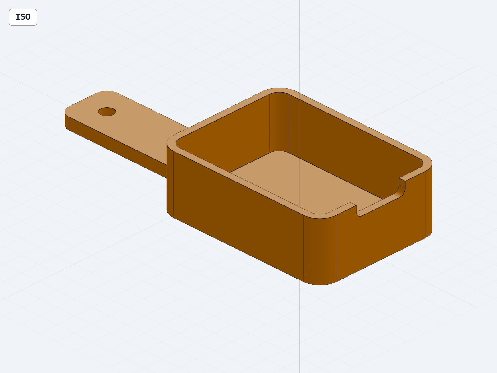](review/workshop_scoop_iso_20260930T030345Z.png) | **[Small-parts scoop](index.html#workshop_scoop)** 110 × 45 × 20; nominal 30.03 mL to pouring lip [STL](workshop_scoop.stl) · [3MF](workshop_scoop.3mf) · [STEP](workshop_scoop.step) · [Source](workshop_scoop.step.py) [Opposite](review/workshop_scoop_opposite_20260930T030345Z.png) · [Top](review/workshop_scoop_top_20260930T030345Z.png) · [Front](review/workshop_scoop_front_20260930T030345Z.png) |
| [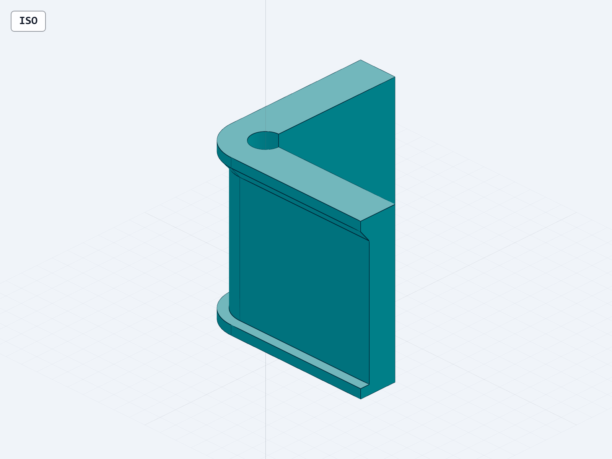](review/strap_corner_iso_20260930T033741Z.png) | **[Strap-clamp corner pad — print four](index.html#strap_corner)** 38 × 38 × 33.5; for 25-wide webbing [STL](strap_corner.stl) · [3MF](strap_corner.3mf) · [STEP](strap_corner.step) · [Source](strap_corner.step.py) [Opposite](review/strap_corner_opposite_20260930T033741Z.png) · [Top](review/strap_corner_top_20260930T033741Z.png) · [Front](review/strap_corner_front_20260930T033741Z.png) |
| [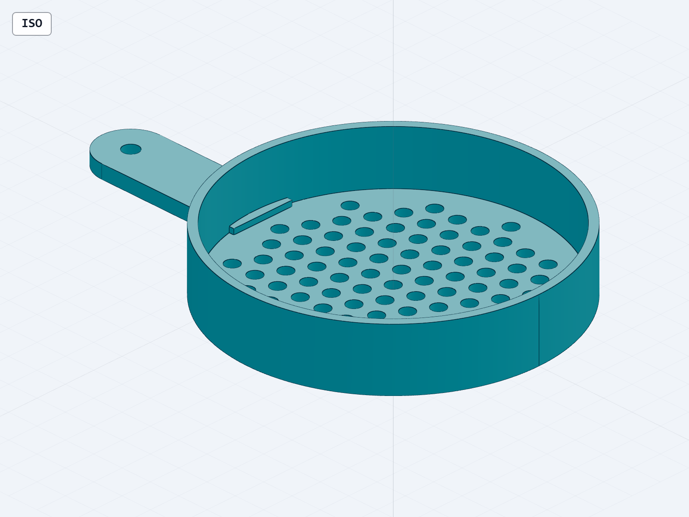](review/sorting_sieve_iso_20260930T035006Z.png) | **[Small-parts sorting sieve](index.html#sorting_sieve)** 135 × 90 × 18; 97 holes, each 4 diameter [STL](sorting_sieve.stl) · [3MF](sorting_sieve.3mf) · [STEP](sorting_sieve.step) · [Source](sorting_sieve.step.py) [Opposite](review/sorting_sieve_opposite_20260930T035006Z.png) · [Top](review/sorting_sieve_top_20260930T035006Z.png) · [Front](review/sorting_sieve_front_20260930T035006Z.png) |
| [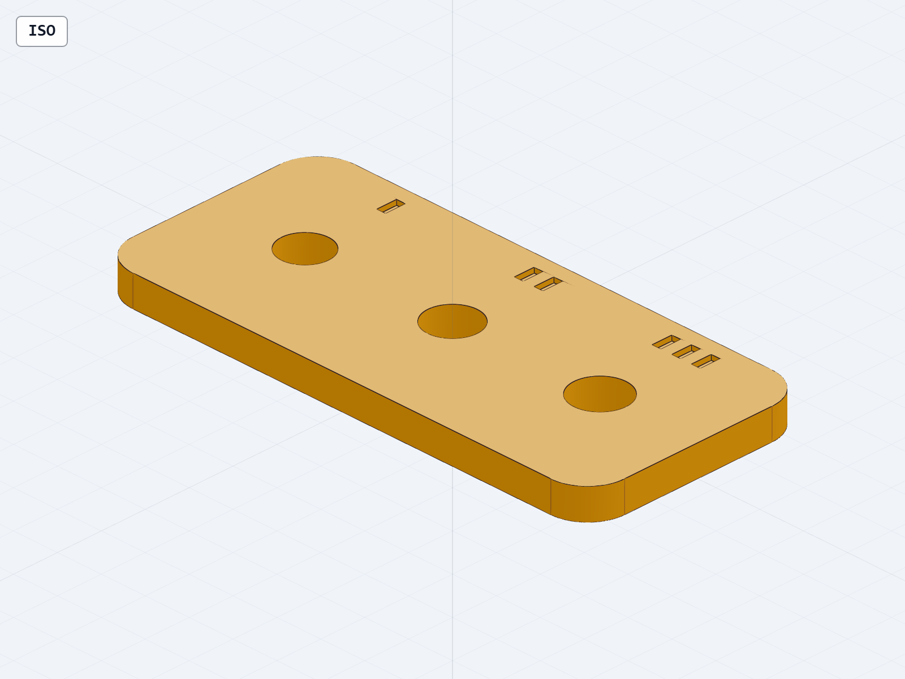](review/sieve_aperture_coupon_iso_20260930T035006Z.png) | **[Sieve aperture coupon](index.html#sieve_aperture_coupon)** 40 × 18 × 2.4; 3.8 / 4 / 4.2 holes [STL](sieve_aperture_coupon.stl) · [3MF](sieve_aperture_coupon.3mf) · [STEP](sieve_aperture_coupon.step) · [Source](sieve_aperture_coupon.step.py) [Opposite](review/sieve_aperture_coupon_opposite_20260930T035006Z.png) · [Top](review/sieve_aperture_coupon_top_20260930T035006Z.png) · [Front](review/sieve_aperture_coupon_front_20260930T035006Z.png) |

## Measured tube adapters

| CAD preview | Model and files |
|---|---|
| [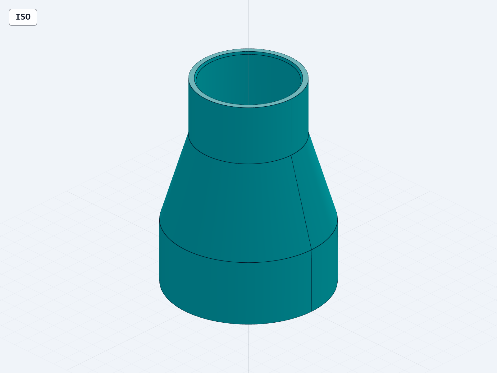](review/tube_reducer_iso_20260930T032754Z.png) | **[Smooth-tube reducer](index.html#tube_reducer)** 55.2 outside diameter × 72 high; 50.4/32.4 sockets [STL](tube_reducer.stl) · [3MF](tube_reducer.3mf) · [STEP](tube_reducer.step) · [Source](tube_reducer.step.py) [Opposite](review/tube_reducer_opposite_20260930T032754Z.png) · [Top](review/tube_reducer_top_20260930T032754Z.png) · [Front](review/tube_reducer_front_20260930T032754Z.png) |
| [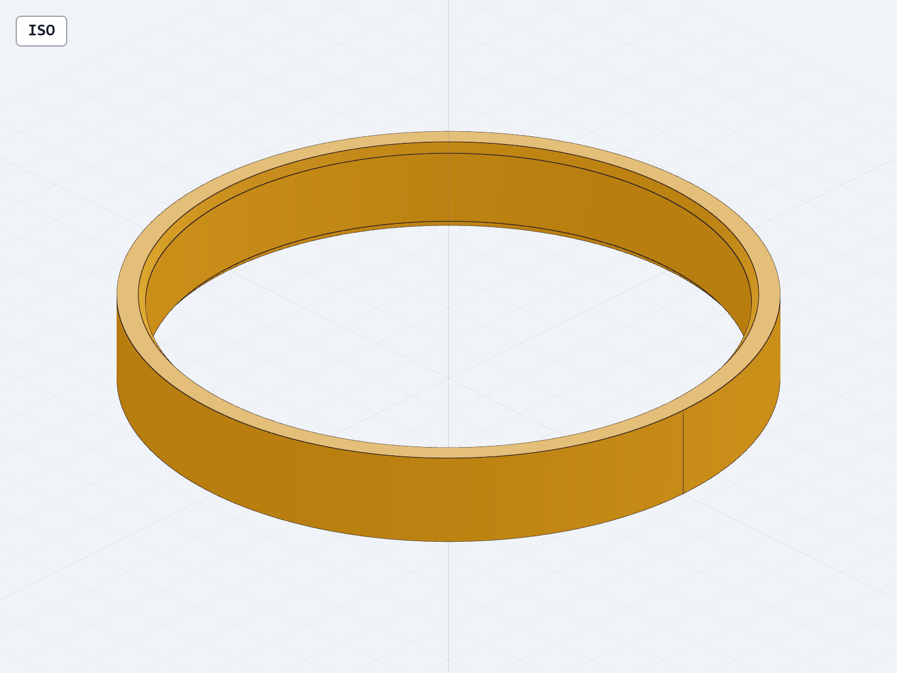](review/socket_fit_ring_iso_20260930T032754Z.png) | **[Socket fit ring](index.html#socket_fit_ring)** 55.2 outside diameter × 8 high; 50.4 working bore [STL](socket_fit_ring.stl) · [3MF](socket_fit_ring.3mf) · [STEP](socket_fit_ring.step) · [Source](socket_fit_ring.step.py) [Opposite](review/socket_fit_ring_opposite_20260930T032754Z.png) · [Top](review/socket_fit_ring_top_20260930T032754Z.png) · [Front](review/socket_fit_ring_front_20260930T032754Z.png) |

## Reference assemblies

| CAD preview | Model and files |
|---|---|
| [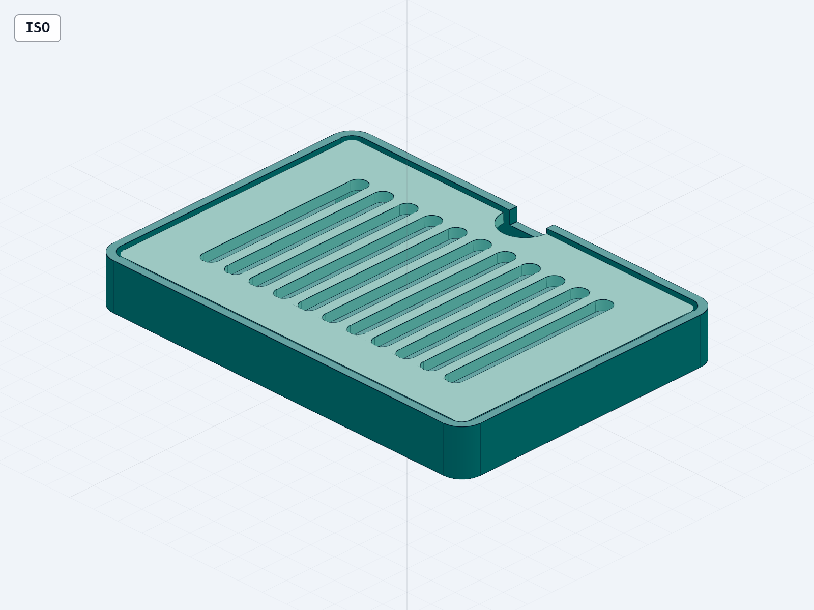](review/soap_dish_assembly_iso_20260930T001900Z.png) | **[Soap dish assembly](index.html#soap_dish_assembly)** 120 × 84 × 14 mm. Tray and draining insert. Print the two components separately. [STEP](soap_dish_assembly.step) · [Source](soap_dish_assembly.step.py) [Opposite](review/soap_dish_assembly_opposite_20260930T001900Z.png) · [Top](review/soap_dish_assembly_top_20260930T001900Z.png) · [Front](review/soap_dish_assembly_front_20260930T001900Z.png) |
| [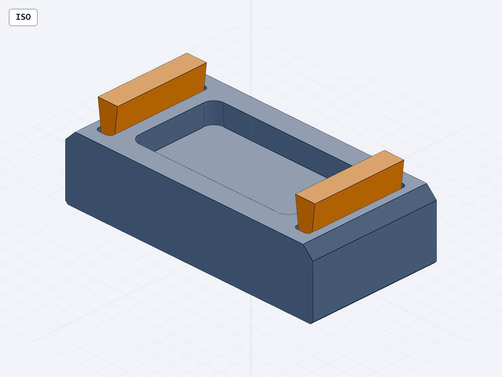](review/sanding_assembly_iso_20260930T005110Z.png) | **[Sanding block assembly](index.html#sanding_assembly)** 100 × 50 × 34.58 mm. Block with two seated wedges. Flexible sandpaper is omitted. [STEP](sanding_assembly.step) · [Source](sanding_assembly.step.py) [Opposite](review/sanding_assembly_opposite_20260930T005110Z.png) · [Top](review/sanding_assembly_top_20260930T005110Z.png) · [Front](review/sanding_assembly_front_20260930T005110Z.png) |
| [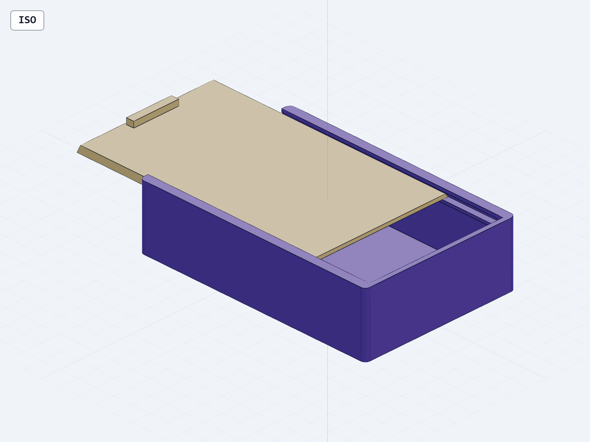](review/sliding_box_assembly_iso_20260930T011106Z.png) | **[Sliding box assembly](index.html#sliding_box_assembly)** 156 × 80 × 33.1 mm. Box with its captured lid 30 mm open. Print box and lid separately. [STEP](sliding_box_assembly.step) · [Source](sliding_box_assembly.step.py) [Opposite](review/sliding_box_assembly_opposite_20260930T011106Z.png) · [Top](review/sliding_box_assembly_top_20260930T011106Z.png) · [Front](review/sliding_box_assembly_front_20260930T011106Z.png) |
| [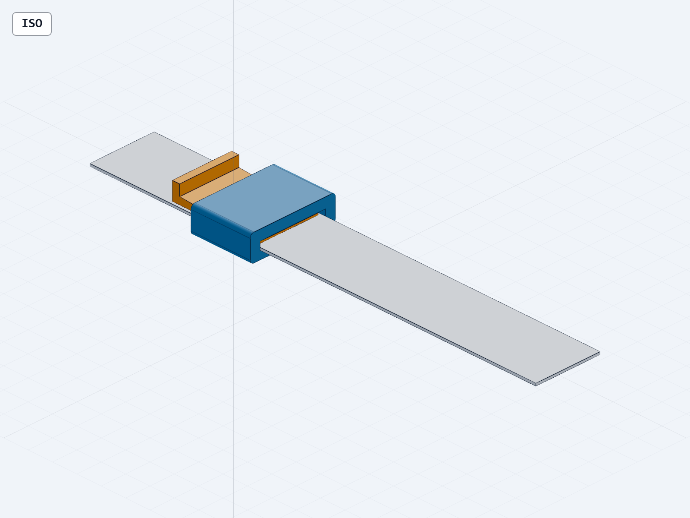](review/ruler_stop_assembly_iso_20260930T031538Z.png) | **[Ruler stop assembly](index.html#ruler_stop_assembly)** 180 × 34.4 × 11 mm. Stop and wedge around an illustrative gray ruler; the ruler is not a print. [STEP](ruler_stop_assembly.step) · [Source](ruler_stop_assembly.step.py) [Opposite](review/ruler_stop_assembly_opposite_20260930T031538Z.png) · [Top](review/ruler_stop_assembly_top_20260930T031538Z.png) · [Front](review/ruler_stop_assembly_front_20260930T031538Z.png) |
| [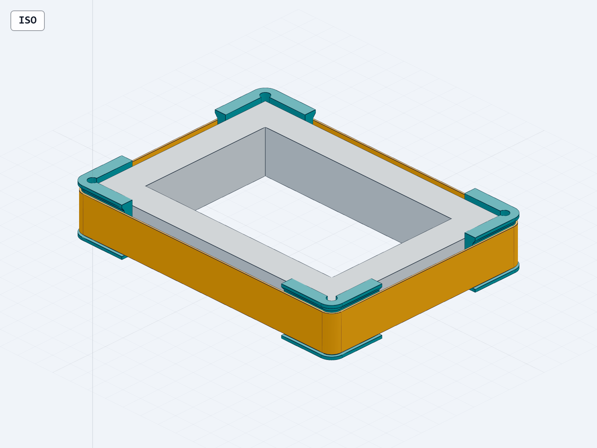](review/strap_clamp_assembly_iso_20260930T033741Z.png) | **[Strap clamp assembly](index.html#strap_clamp_assembly)** 196 × 146 × 33.5 mm. Four corner pads around a reference frame and strap. Frame and strap are not prints. [STEP](strap_clamp_assembly.step) · [Source](strap_clamp_assembly.step.py) [Opposite](review/strap_clamp_assembly_opposite_20260930T033741Z.png) · [Top](review/strap_clamp_assembly_top_20260930T033741Z.png) · [Front](review/strap_clamp_assembly_front_20260930T033741Z.png) |
| [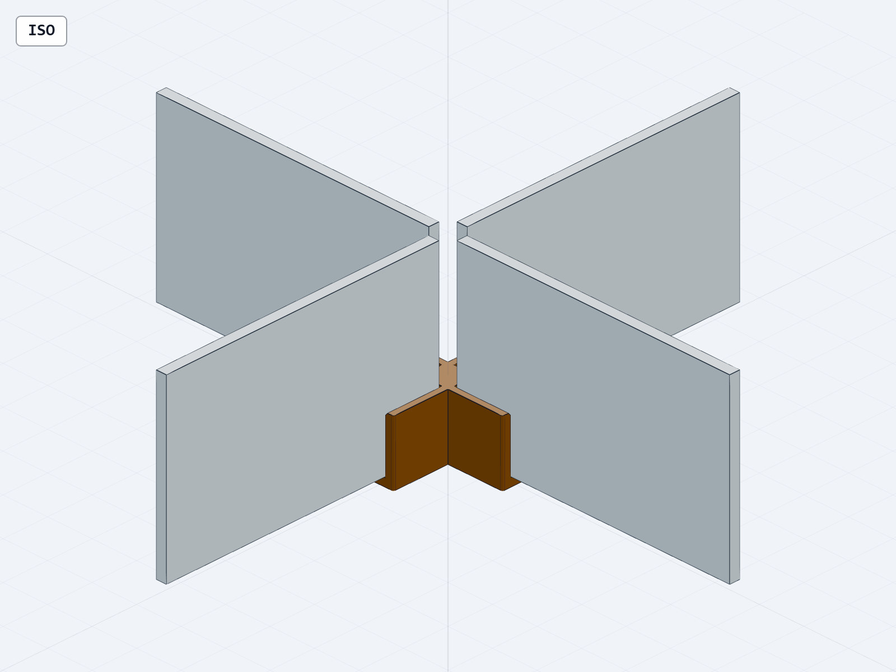](review/divider_joint_assembly_iso_20261001T005829Z.png) | **[Divider joint assembly](index.html#divider_joint_assembly)** 168.2 × 168.2 × 52.4 mm. Cross connector with four separate reference boards. Only the connector is printed. [STEP](divider_joint_assembly.step) · [Source](divider_joint_assembly.step.py) [Opposite](review/divider_joint_assembly_opposite_20261001T005829Z.png) · [Top](review/divider_joint_assembly_top_20261001T005829Z.png) · [Front](review/divider_joint_assembly_front_20261001T005829Z.png) |

