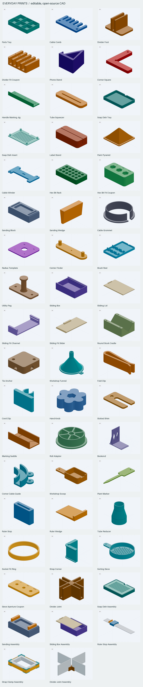
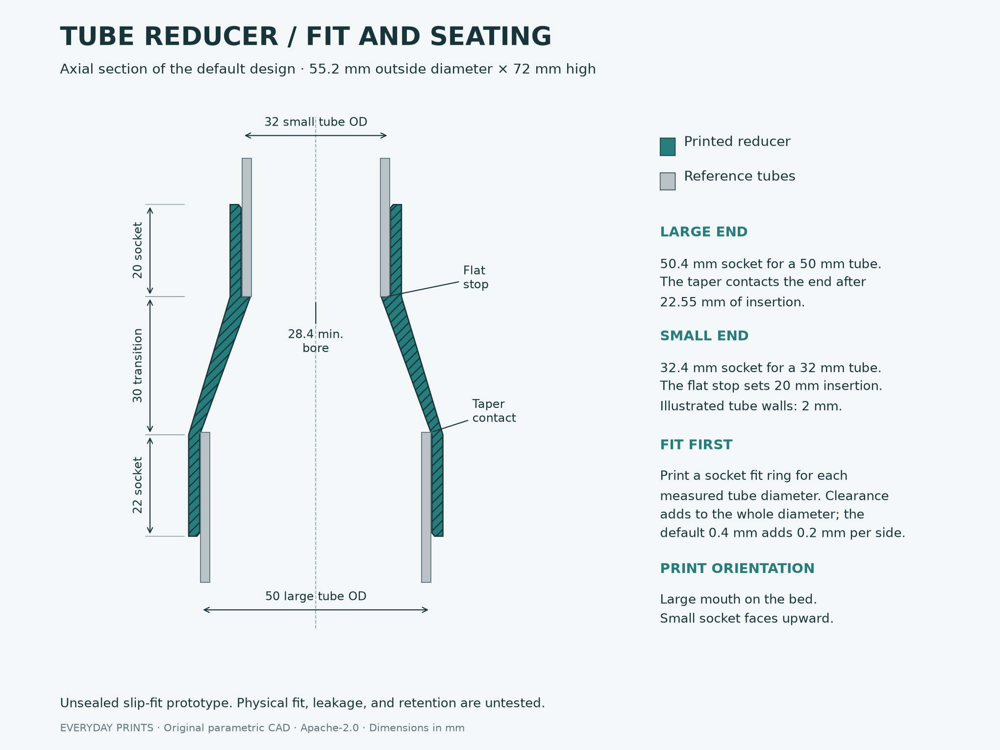
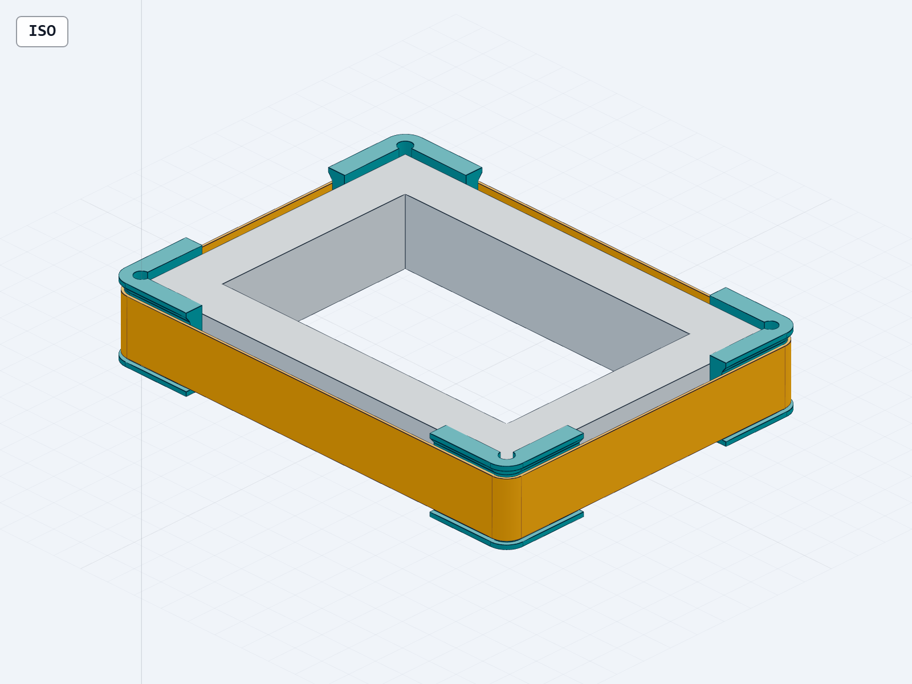
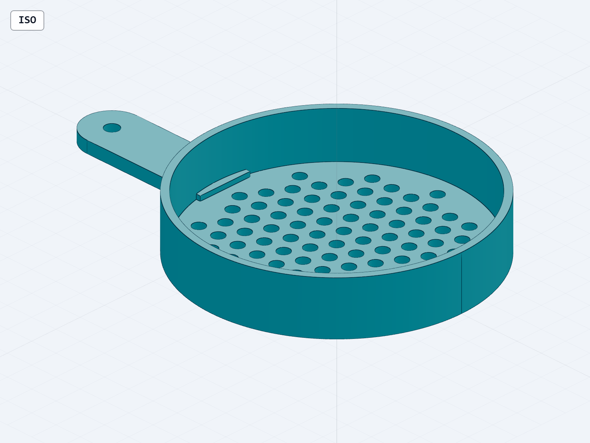
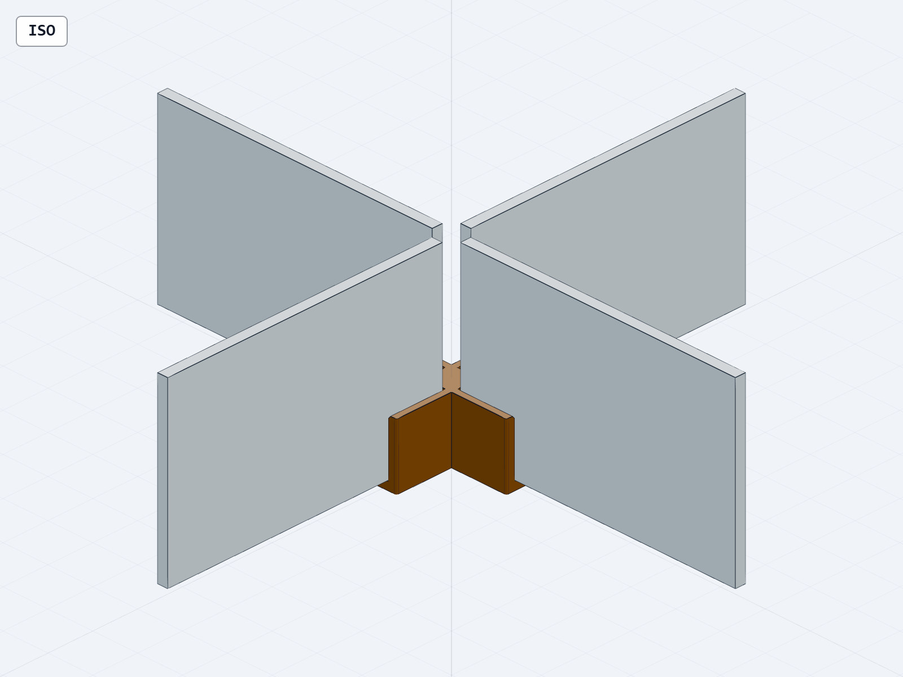

# Everyday Prints

Forty-seven original, adjustable print files for home organization, plant labeling,
and small workshop tasks, plus six assembly references.
Source, STEP, STL, and geometry-only 3MF are included under [Apache-2.0](LICENSE).

[Download the complete collection](everyday-prints.zip).
[Browse the searchable image gallery](index.html) · [Markdown image index](INDEX.md).
[Customize models in the browser](https://everyday-prints.metzdevan.workers.dev) · [Cloud app source and deployment guide](cloud/README.md).
[Summary of the work completed in this thread](THREAD_SUMMARY.md).

The local cloud app now offers CAD ZIPs and fitted assembly kits with STEP,
STL, 3MF, print quantities, fit coupons, and source for rebuilding saved dimensions.
It accepts fine decimal measurements and preserves kit quantities and fit-coupon
labels when rebuilding downloaded sources.
Revert edits restores the last verified preview's dimensions for immediate
downloads, including cached CAD kits.
Changed measurements now show their last verified preview value. Revert value
restores just that measurement while keeping the other edits. Downloads become
available when all fields match the verified preview again.
Saved dimensions can be exported as JSON and loaded back into the customizer,
including parameters.json from CAD downloads, without starting a build.
Saved dimensions also keeps up to 20 named versions in this browser. Save valid
measurements before building, reopen a part or assembly version, or remove a
version while keeping current fields and files. Changed versions require Update
preview; matching versions can reuse verified STL and cached CAD downloads.
Save dimensions keeps a portable backup outside browser storage.
Rename version uses the name above the saved-version list. Replace dimensions
saves the current measurements into the selected version of the open model.
Both keep its identity and current preview files; changed dimensions still need
Update preview.
Undo last version change restores the library before the latest successful
save, rename, replacement, removal or import. Current measurements and files stay
in the editor. Undo is available in this tab until a newer change or refresh.
Saved-version lists refresh when another tab changes the library. Current
measurements, preview files and cached CAD stay in the editor.
Export versions saves all version names and measurements in one JSON backup.
Import versions merges that file into another browser, keeps existing entries,
numbers conflicting names and skips already saved versions. Imports leave the
current measurements and verified files in the editor.
Unfinished measurements can recover after refreshing the same view in this tab,
including blank fields and invalid lists. Recovered custom dimensions still need
Update preview. Save dimensions keeps a portable file.
Valid files confirm their dimensions and focus the first field immediately,
including when the original preview is slow or unavailable. Update preview can
build that saved version; downloads require a verified mesh matching the inputs.
Save dimensions and Copy link supersede pending imports, preserving the values
used by the action. Stalled file reads recover after 15 seconds and keep verified
downloads available; old file results cannot overwrite a newer selection.
Retry original preview reloads a missing or stalled catalog mesh without a CAD
build, keeping current measurements and browser history. Edited dimensions still
need Update preview before downloading their version.
Editing, saved files and shared links enforce the same field limits. Rejected
links show original dimensions with an explanation; fine decimal measurements
are preserved, and invalid edits cannot be saved or shared.
Invalid measurements show a message beside their field. Blocked Save dimensions
and Copy link actions focus that field; failed imports show their message beside
Load dimensions and preserve the current values and verified files.
Copy link keeps the latest requested link when writes overlap and offers the
page URL when clipboard access is denied or slow.
Stop waiting keeps edits and the last verified preview during slow builds;
stalled requests also recover after a 15-minute browser waiting limit.
Verified files become ready even while 3D viewing loads or is unavailable.
The editor distinguishes building, receiving files, and verifying them. A
separate received-byte count preserves saved-dimension and error messages, and
downloads become available only after verification.
File transfers stop at the 8 MiB limit; interrupted downloads preserve the last
verified preview and allow retrying.
Original preview transfers recover after 15 seconds without new headers or file
bytes. Active receipts reset that timer. Retry original preview keeps your
measurements and reloads the static file; expired replies cannot replace newer
previews or interrupt CAD work.
Keyboard retry returns focus to a visible measurement, including after the 3D
toolbar loads. Moving to another field during recovery keeps your chosen focus.

Received bytes are copied immediately, preserving exact files when a transport
reuses its chunk buffers or includes empty chunks.
Preview and CAD response details are checked before transferring files. Invalid
responses and late replies to stopped or superseded requests release their
unused bodies immediately, keeping the current dimensions and verified files.
Unexpected generated file types restore retry controls immediately.
Unreadable build and download failures show retry instructions while preserving
the current dimensions and verified preview. Pending error transfers can be
stopped; slow failure details restore retry controls within five seconds after
the failure response arrives. Verified files and measurements are kept.
These additions are included in the collection's cloud source and are not yet
deployed to the public library.
Customized STL and CAD/kit filenames include the verified preview dimensions
and a short file fingerprint, so variants remain recognizable after downloading.
Check printer fit compares the verified STL with your printer’s usable width,
depth and height. It identifies a possible 90° turn on the bed and keeps the last
verified preview distinct from unbuilt edits. Build volume is saved in this
browser; reference assemblies direct checks to their printable components.
Account for brims and printer clearances in your slicer.
Saved build volumes follow changes from other open tabs. Active or incomplete
printer entries are kept until Use saved build volume applies the latest values.
Unreadable saved settings preserve the current check and offer retry guidance.
Incomplete or invalid printer edits keep the last saved build volume through
refresh and in other tabs. Complete three positive values to save changes;
Clear build volume or empty all three fields to remove them.
Use saved build volume can also restore incomplete edits or a failed save when
saved settings are available, keeping your preview and downloads.

Keyboard focus moves to Stop waiting when a focused build control is disabled,
then returns after the request ends. Editing another field keeps its focus.
Unavailable model links explain the problem and recover to the library, where
visitors can choose another part without carrying over the unavailable model's measurements.
Parameter hints show declared ranges, whole-number rules and the numeric-list
limit before editing, and are included in each input's accessible description.
Measurement inputs have a minimum height of 44 px, matching the main actions.
Keyboard Stop and download controls stay visible through delayed 3D loading,
including short phone and desktop windows.
If browser graphics are interrupted, the editor shows the original image while
keeping verified files and dimensions. Graphics recovery redraws the current
mesh and retains its camera view, edge display, edits and pending downloads.
Updating a preview or refreshing the original mesh for a CAD download keeps
its camera angle, zoom, pan and Edges setting. Framing follows the new mesh size
and center; opening another model or reopening the editor starts the usual 3D view.

Reopening a library model or updating a previously downloaded version can reuse
its retained preview when the model and measurements match, including STL-only
downloads. Matching CAD/kit files are also reused when retained. The preview is
verified again, with Stop waiting available during restoration. When CAD reports
a different mesh, Update preview builds a fresh version and keeps your previous
verified STL available during recovery.

Back and Forward also reuse retained CAD and parts-kit downloads with their
verified preview dimensions and filenames. History shares a 32 MiB file cache;
previews take priority when older ZIPs need to be built again. Reused files count
once across saved views, so reopening them keeps room for other downloads.

Library transfers recover with Try again after stalled headers or bodies,
oversized responses, or invalid text. Retry preserves searches, filters and
shared dimensions, and late responses cannot replace a newer attempt.
Verified previews also check the STL's facet records and measured dimensions,
including when 3D graphics are unavailable. Inconsistent files preserve the last
verified preview and offer a working retry.



These designs have been checked in CAD; physical print testing is still pending.
Start with a matching fit coupon where provided. Dimensions are mm.

| Design | Default dimensions, in print orientation | Print | Edit |
|---|---|---|---|
| Divided parts tray | 150 × 100 × 24; six pockets | [STL](parts_tray.stl) · [3MF](parts_tray.3mf) | [Python](parts_tray.step.py) · [STEP](parts_tray.step) |
| Desk-edge cable comb | 59 × 32 × 4; five slots | [STL](cable_comb.stl) · [3MF](cable_comb.3mf) | [Python](cable_comb.step.py) · [STEP](cable_comb.step) |
| Drawer-divider foot | 34 × 24 × 20; 3.4 slot | [STL](divider_foot.stl) · [3MF](divider_foot.3mf) | [Python](divider_foot.step.py) · [STEP](divider_foot.step) |
| Divider fit coupon | 26 × 20 × 8; four slots | [STL](divider_fit_coupon.stl) · [3MF](divider_fit_coupon.3mf) | [Python](divider_fit_coupon.step.py) · [STEP](divider_fit_coupon.step) |
| Phone stand | 85 × 96 × 65; prints on its side | [STL](phone_stand.stl) · [3MF](phone_stand.3mf) | [Python](phone_stand.step.py) · [STEP](phone_stand.step) |
| Corner square | 80 × 80 × 8; 18 wide legs | [STL](corner_square.stl) · [3MF](corner_square.3mf) | [Python](corner_square.step.py) · [STEP](corner_square.step) |
| Handle marking jig | 160 × 40 × 18; 128 hole pitch | [STL](handle_marking_jig.stl) · [3MF](handle_marking_jig.3mf) | [Python](handle_marking_jig.step.py) · [STEP](handle_marking_jig.step) |
| Tube squeezer | 90 × 26 × 6; 64 × 2 working slot | [STL](tube_squeezer.stl) · [3MF](tube_squeezer.3mf) | [Python](tube_squeezer.step.py) · [STEP](tube_squeezer.step) |
| Soap-dish catch tray | 120 × 84 × 14 | [STL](soap_dish_tray.stl) · [3MF](soap_dish_tray.3mf) | [Shared parameters](soap_dish_common.py) · [STEP](soap_dish_tray.step) |
| Soap-dish draining insert | 113.2 × 77.2 × 11; feet print upward | [STL](soap_dish_insert.stl) · [3MF](soap_dish_insert.3mf) | [Shared parameters](soap_dish_common.py) · [STEP](soap_dish_insert.step) |
| Leaning label stand | 50 × 24 × 12; 0.8 slot, 12° lean | [STL](label_stand.stl) · [3MF](label_stand.3mf) | [Python](label_stand.step.py) · [STEP](label_stand.step) |
| Finishing pyramid | 50 × 50 × 26; 2.4 square contact tip | [STL](paint_pyramid.stl) · [3MF](paint_pyramid.3mf) | [Python](paint_pyramid.step.py) · [STEP](paint_pyramid.step) |
| Cord winder | 95 × 44 × 4; 22 wide waist | [STL](cable_winder.stl) · [3MF](cable_winder.3mf) | [Python](cable_winder.step.py) · [STEP](cable_winder.step) |
| Hex-bit rack | 80 × 44 × 14; eighteen 6.7 hex sockets | [STL](hex_bit_rack.stl) · [3MF](hex_bit_rack.3mf) | [Python](hex_bit_rack.step.py) · [STEP](hex_bit_rack.step) |
| Hex-bit fit coupon | 40 × 20 × 14; three trial sockets | [STL](hex_bit_fit_coupon.stl) · [3MF](hex_bit_fit_coupon.3mf) | [Python](hex_bit_fit_coupon.step.py) · [STEP](hex_bit_fit_coupon.step) |
| Hand sanding block | 100 × 50 × 25; two paper-clamp slots | [STL](sanding_block.stl) · [3MF](sanding_block.3mf) | [Shared parameters](sanding_common.py) · [STEP](sanding_block.step) |
| Sanding wedge — print two | 8 × 36 × 20; narrow tip down | [STL](sanding_wedge.stl) · [3MF](sanding_wedge.3mf) | [Shared parameters](sanding_common.py) · [STEP](sanding_wedge.step) |
| Desk cable grommet | 68 flange diameter × 18.4 high; 60 nominal opening | [STL](cable_grommet.stl) · [3MF](cable_grommet.3mf) | [Python](cable_grommet.step.py) · [STEP](cable_grommet.step) |
| Corner-radius template | 80 × 80 × 3; radii 5, 10, 15, 20 | [STL](radius_template.stl) · [3MF](radius_template.3mf) | [Python](radius_template.step.py) · [STEP](radius_template.step) |
| Center-finding jig | 100 × 24 × 16; 72 maximum stock width | [STL](center_finder.stl) · [3MF](center_finder.3mf) | [Python](center_finder.step.py) · [STEP](center_finder.step) |
| Brush rest and catch tray | 100 × 150 × 20; three paired cradles | [STL](brush_rest.stl) · [3MF](brush_rest.3mf) | [Python](brush_rest.step.py) · [STEP](brush_rest.step) |
| Utility peg | 60 × 24 × 31; 10 stem, 16 retaining head | [STL](utility_peg.stl) · [3MF](utility_peg.3mf) | [Python](utility_peg.step.py) · [STEP](utility_peg.step) |
| Sliding-lid box | 120 × 80 × 32; 2.4 floor and walls | [STL](sliding_box.stl) · [3MF](sliding_box.3mf) | [Shared parameters](sliding_box_common.py) · [STEP](sliding_box.step) |
| Sliding lid | 123.2 × 74.6 × 5.4 including pull grip | [STL](sliding_lid.stl) · [3MF](sliding_lid.3mf) | [Shared parameters](sliding_box_common.py) · [STEP](sliding_lid.step) |
| Sliding fit channel | 30 × 80 × 16; short rail sample | [STL](sliding_fit_channel.stl) · [3MF](sliding_fit_channel.3mf) | [Shared parameters](sliding_box_common.py) · [STEP](sliding_fit_channel.step) |
| Sliding fit slider | 36 × 74.6 × 5.4; matching sample | [STL](sliding_fit_slider.stl) · [3MF](sliding_fit_slider.3mf) | [Shared parameters](sliding_box_common.py) · [STEP](sliding_fit_slider.step) |
| Round-stock cradle | 80 × 60 × 30; 90° V groove | [STL](round_stock_cradle.stl) · [3MF](round_stock_cradle.3mf) | [Python](round_stock_cradle.step.py) · [STEP](round_stock_cradle.step) |
| Cable-tie anchor | 26 × 26 × 8.6; two threading directions | [STL](tie_anchor.stl) · [3MF](tie_anchor.3mf) | [Python](tie_anchor.step.py) · [STEP](tie_anchor.step) |
| Workshop funnel | 70 mouth, 10 spout bore; 60 high | [STL](workshop_funnel.stl) · [3MF](workshop_funnel.3mf) | [Python](workshop_funnel.step.py) · [STEP](workshop_funnel.step) |
| Folded-bag clip — flexure trial | 50.4 × 10.8 × 12; 0.609 rounded throat | [STL](fold_clip.stl) · [3MF](fold_clip.3mf) | [Python](fold_clip.step.py) · [STEP](fold_clip.step) |
| Cord clip — flexure trial | 20 × 9.495 × 12; 6.6 cavity, 5.2 entry | [STL](cord_clip.stl) · [3MF](cord_clip.3mf) | [Python](cord_clip.step.py) · [STEP](cord_clip.step) |
| Hex-nut hand knob | 40 × 36.249 × 14; six rounded lobes | [STL](hand_knob.stl) · [3MF](hand_knob.3mf) | [Python](hand_knob.step.py) · [STEP](hand_knob.step) |
| Slotted spacing shim | 40 × 24 × 2; 6.6 wide open slot | [STL](slotted_shim.stl) · [3MF](slotted_shim.3mf) | [Python](slotted_shim.step.py) · [STEP](slotted_shim.step) |
| 90°/45° marking saddle | 90 × 44.5 × 23; for a measured 38 wide board | [STL](marking_saddle.stl) · [3MF](marking_saddle.3mf) | [Python](marking_saddle.step.py) · [STEP](marking_saddle.step) |
| Roll-core adapter — print two | 60 flange diameter × 17.4 high; 8.6 axle bore | [STL](roll_adapter.stl) · [3MF](roll_adapter.3mf) | [Python](roll_adapter.step.py) · [STEP](roll_adapter.step) |
| Braced bookend | 130 × 80 × 130; flat face and broad foot | [STL](bookend.stl) · [3MF](bookend.3mf) | [Python](bookend.step.py) · [STEP](bookend.step) |
| Corner cable guide | 41.507 × 41.507 × 10.4; 10 wide curved channel | [STL](corner_cable_guide.stl) · [3MF](corner_cable_guide.3mf) | [Python](corner_cable_guide.step.py) · [STEP](corner_cable_guide.step) |
| Small-parts scoop | 110 × 45 × 20; nominal 30.03 mL to pouring lip | [STL](workshop_scoop.stl) · [3MF](workshop_scoop.3mf) | [Python](workshop_scoop.step.py) · [STEP](workshop_scoop.step) |
| Blank plant marker | 26 × 115 × 2.4; 70 long stake | [STL](plant_marker.stl) · [3MF](plant_marker.3mf) | [Python](plant_marker.step.py) · [STEP](plant_marker.step) |
| Adjustable ruler-stop body | 34.4 × 10.2 × 24; prints on an end profile | [STL](ruler_stop.stl) · [3MF](ruler_stop.3mf) | [Shared parameters](ruler_stop_common.py) · [STEP](ruler_stop.step) |
| Ruler-stop wedge | 35 × 24 × 7 including pull grip | [STL](ruler_wedge.stl) · [3MF](ruler_wedge.3mf) | [Shared parameters](ruler_stop_common.py) · [STEP](ruler_wedge.step) |
| Smooth-tube reducer | 55.2 outside diameter × 72 high; 50.4/32.4 sockets | [STL](tube_reducer.stl) · [3MF](tube_reducer.3mf) | [Python](tube_reducer.step.py) · [STEP](tube_reducer.step) |
| Socket fit ring | 55.2 outside diameter × 8 high; 50.4 working bore | [STL](socket_fit_ring.stl) · [3MF](socket_fit_ring.3mf) | [Python](socket_fit_ring.step.py) · [STEP](socket_fit_ring.step) |
| Strap-clamp corner pad — print four | 38 × 38 × 33.5; for 25-wide webbing | [STL](strap_corner.stl) · [3MF](strap_corner.3mf) | [Shared parameters](strap_corner_common.py) · [STEP](strap_corner.step) |
| Small-parts sorting sieve | 135 × 90 × 18; 97 holes, each 4 diameter | [STL](sorting_sieve.stl) · [3MF](sorting_sieve.3mf) | [Python](sorting_sieve.step.py) · [STEP](sorting_sieve.step) |
| Sieve aperture coupon | 40 × 18 × 2.4; 3.8 / 4 / 4.2 holes | [STL](sieve_aperture_coupon.stl) · [3MF](sieve_aperture_coupon.3mf) | [Python](sieve_aperture_coupon.step.py) · [STEP](sieve_aperture_coupon.step) |
| Modular divider joint | 40.2 × 40.2 × 18; selectable cross, T, corner, straight | [STL](divider_joint.stl) · [3MF](divider_joint.3mf) | [Shared parameters](divider_joint_common.py) · [STEP](divider_joint.step) |

[Assembled soap dish — view only](soap_dish_assembly.step): print its tray and
insert separately.
[Assembled sanding block — view only](sanding_assembly.step): print one block
and two wedges separately. The reference omits flexible sandpaper.
[Assembled sliding box — view only](sliding_box_assembly.step): print the box
and lid separately. The reference shows the lid 30 open.
[Assembled ruler stop — view only](ruler_stop_assembly.step): print one body
and one wedge. The gray strip illustrates a metal ruler and is not a print file.
[Strap clamp around a frame — view only](strap_clamp_assembly.step): print four
corner pads. The gray frame and orange strap illustrate the fit; the strap's
tensioner, buckle, and material deformation are omitted.
[Divider joint and boards — view only](divider_joint_assembly.step): print the
connector and cut separate board segments to suit the drawer. Gray boards are references.

## Print and use

All exports already sit on Z=0 in their intended printing orientation. Start
with a 0.4 mm nozzle, 0.2 mm layers, three or four perimeters, and 15–25% infill.
Use your printer's established material profile. PLA is a practical first trial
for the rigid indoor organizers; see the separate material notes for the two
flexure clips below. Inspect the slicer preview before printing.
The 3MF files contain geometry and units, not machine settings or G-code.

**Tray.** Print the floor down and pockets up. The six pockets are 46.8 × 46.4
with 22 usable depth. Change `columns` and `rows` to suit screws, components,
craft supplies, or game pieces. The outside and pocket corner radii preserve
the 2.4 wall thickness around the rounded corners.

**Cable comb.** The actual slot widths are 3.6, 4.6, 5.6, 6.6, and 8.6, from
left to right viewed from above with slots opening away from you. Mount the
continuous rear strip to the desktop with suitable tape or two screws through
the 4.5 holes. Let the slots extend over the desk edge. Cables enter through the
open ends; larger connector bodies can rest above the slots. This is an open
guide, so a cable can slide out through its slot mouth. Match the slot to your
cable and connector before making several.

**Divider feet and coupon.** Measure the divider board and set `board_thickness`
in both sources. Print the coupon first. Its slots add 0.2, 0.4, 0.6, and 0.8 to
that thickness, with one through four ticks on the top of each slot's left rib.
Pick the slot that slides on comfortably and put that value in the foot's
`clearance`. Clearance is the **total added width**, not the amount on each side.
Print at least two feet per divider; the board sits on the 2.4 floor. A removable
adhesive pad under a foot can help it stay in place. Allow for the floor when
choosing board height. Both ends of the coupon slots are open so a full-length
board can pass through without trimming a sample.

**Phone stand.** Print as supplied, with one full side profile on the bed and
the 65 width vertical. After printing, turn it onto the long flat lower edge.
The phone rests 68° above horizontal. The 15 deep horizontal seat is intended
as a starting point for phones/cases up to roughly 13 thick; measure yours and
adjust `seat_depth`. The continuous ledge suits landscape use and phones charged
at the side. It does not provide a bottom charging-cable opening. The triangular
opening reduces material and prints as a vertical through-hole in this orientation.

**Corner square.** Place the two straight inside edges against the workpieces.
The round corner relief clears glue and imperfect inside corners. Verify the
printed angle with a known square or a flip-line check before relying on it for
layout. It is a printable reference, not a calibrated measuring instrument.

**Handle marking jig.** After printing, flip the template so its tall fence
hangs down over the panel edge while the plate rests on the panel face. Place
the inside face of the fence against that edge. The default holes lie 25 from
that face: two at 128 center-to-center and a
third at the midpoint for a knob. Align the front V notch with your handle
centerline. Mark through the holes using a fine pencil or awl, remove the jig,
and drill separately. Set `hole_pitch` to your actual handle's spacing and
`setback` to the desired offset. This plastic template has no drill bushings.

**Tube squeezer.** Print flat. Feed the flattened tail of a soft tube through
the slot, then slide the squeezer gently toward the tube opening. The working
throat is 64 long and 2 wide, with beveled entries on both faces. Set
`slot_length` longer than the flattened tube width and choose `slot_gap` to suit
the actual tube. Try an empty tube first and smooth any rough printed edges.
The tool contacts the outside of the packaging.

**Draining soap dish.** Print one tray floor down and one insert with its
slotted plate down and feet pointing up, exactly as supplied. Turn the insert
over and place its four feet inside the tray. Both the lift notch and the small
pouring notch face the same side. The slotted surface sits 0.6 below the rim,
with 8 of space underneath for drainage. Lift out the insert to empty and wash
the catch tray. PETG is a reasonable starting material for repeated wet use;
check your filament's normal print profile. Watertightness of the printed tray
depends on extrusion and wall bonding and has not been physically tested.
Resize the entire set in [soap_dish_common.py](soap_dish_common.py).
`side_clearance` is the gap on **each side** of the insert, unlike the total
clearance used by the divider foot.

**Leaning label stand.** Print the rounded base down. Slide a card into the
open-ended slot from above or from either end. The card leans 12° from vertical
and sits on a 4 thick floor. `slot_gap` is measured perpendicular to the card:
the default is 0.8, with 8 of insertion depth. Measure your card and allow some
sliding clearance. A small sign is the intended use; increase the base width
for a taller card and check stability on your actual surface.

**Finishing pyramid.** Print the broad foot down. Use three or more supports
under a small workpiece while applying a finish. The tip is a 2.4 square flat
contact patch; it can leave a mark in soft material or uncured finish. Try a
scrap piece first and place the contact points on a concealed face. `base_size`,
`height`, and `tip_size` control the footprint, lift, and contact area. No load
capacity has been established.

**Cord winder.** Print flat. Wrap a flexible cord loosely around the central
waist. The two open end notches provide places to park the ends; use a small
reusable tie through the center slot to secure the bundle for transport. The
notches are 3.6 wide, so adjust `notch_gap` for your cord. Keep bends gentle and
leave stiff cables or bulky strain reliefs outside the wrapped section.

**Hex-bit rack and coupon.** Print the flat floor down and sockets upward.
Print the coupon first using the same settings as the rack. With the row of
top tick marks behind the sockets, one, two, and three marks identify added
across-flat clearances of 0.15, 0.35, and 0.55. For the default 6.35 nominal
shank, the working socket widths are 6.50, 6.70, and 6.90 across flats. Choose
the socket that lets your actual bit enter and leave comfortably, then set the
rack's `clearance` to that added width. Both parts have an 11.6 deep blind socket
and a beveled mouth. Clearance is added to the total across-flat dimension.
Set `columns`, `rows`, and `pitch` for the desired layout; the default rack has
18 sockets on 12 centers. This is an upright tabletop holder; it has no lid or
retaining mechanism for carrying loose bits.

**Hand sanding block.** Print one block sole down and two wedges narrow tip
down, as supplied. A small brim can help the wedges adhere. Smooth rough edges
at the paper slots before use. Start with a paper blank about 50 wide and 200
long. Wrap it abrasive side outward around the sole and both ends; mark and
trim the length so each end extends about 10 into its top slot. Trim the last
12 of each end to a centered **36 wide tab** so it clears the closed slot ends.
Tuck each tab against the outside slot wall and press a wedge in gently while
keeping the paper taut. The center recess gives your fingers a place to hold
the block. This design relies on friction; paper compression and wedge grip
need a physical trial. Pull the exposed wedge tops to replace the paper.

Edit [sanding_common.py](sanding_common.py) to resize both parts together.
`paper_thickness` controls the illustrated engagement and validates remaining
travel. The default assembly assumes 0.3 thick paper: the wedges enter 10.42,
leave 3.58 below their tips, and protrude 9.58 above the block. For other sizes,
cut the paper to `width` and its end tabs to
`slot_span - 2*wedge_end_clearance`. Adjust paper length by wrapping it around
the actual print before trimming.

**Desk cable grommet.** Print flange down, then turn it over to insert the
sleeve through the panel opening. Measure that opening and set `hole_diameter`;
the default 60 setting produces a 59.6 outside-diameter sleeve with 16 insertion
depth. The flange is 68 in diameter and 2.4 thick. `clearance` is diametral.
The 10 wide side opening lets a suitably sized cable enter from the side;
set `opening=0` for a closed ring. The bore is 55.6 at the default wall setting.
Check cable clearance and smooth any rough contact edges. This is an unlatched
liner held in place by its flange and fit, with no cable strain-relief clamp.

**Corner-radius template.** Print flat with the ticks facing up. Align the two
straight edges beside the selected arc with the workpiece edges, then trace
the arc using a fine pencil. One, two, three, and four ticks identify radii
5, 10, 15, and 20 respectively. The `radii` list follows those same tick IDs;
update your written size key when changing it. Verify a printed radius and
edge alignment before using the template for layout. It is a marking aid.

**Center-finding jig.** Print the plate down and both pins upward. Turn the
finished jig over so the pins straddle the parallel edges of a board or strip.
Rotate until both pins touch the edges; mark through the middle hole with a
sharp pencil. Keep both pins in contact while sliding to draw a centerline.
The equal pin radii place the marking hole halfway between those edges.
The default maximum stock width is `pin_spacing - pin_diameter`, or 72.
Give the 12 long pins space below thin stock so they do not bottom out on your
bench. Verify centering on scrap, particularly if the pins have print seams
or rough spots. It relies on parallel workpiece edges and equal pin contact.

**Brush rest and catch tray.** Print floor down. Set a handle across a matching
pair of cradles, with its bristles above the larger clear area in front of the
rests. The default cradle widths are 8.6, 12.6, and 16.6. Position the brush so
it balances on both rests and its wet end lies over the catch area. Adjust
`groove_diameters`, `rail_spacing`, `rear_inset`, and tray `length` for your
brushes. Small peaked openings connect the compartments beneath the rests;
the front rim has a lowered pouring lip. Remove brushes before emptying and
clean the tray between uses. Liquid retention depends on the actual print.

**Utility peg.** Print with the flat mounting back on the bed. Fasten that
back to a suitable surface through both 4.4 holes, which are 44 apart. The peg
projects 28 from the plate and has a 10 diameter stem and 16 diameter retaining
head. Open reusable cable ties, loop them around the stem, and close them for
storage; a closed loop must be large enough to pass over the head. The root
widens into the plate and the head grows gradually for printing. `peg_length`,
`peg_diameter`, and `head_diameter` control the working shape. Mounting and
holding strength have not been physically tested; no load rating is claimed.

**Sliding-lid box and fit pair.** Print the channel sample and its matching
slider first, using the same material and settings planned for the full box.
Both sit flat as supplied; the slider's wide face goes down and its grip goes
up. Slide the chamfered rear edge into the sample channel with the grip left
outside. It should travel comfortably while remaining captured vertically.
Remove any first-layer flare or rough spots before assessing the fit. Adjust
`side_clearance` in [sliding_box_common.py](sliding_box_common.py), then rebuild
both samples. A change of 0.05–0.1 is a useful trial increment.

After the sample fits, print one full box floor down and one lid wide face
down. Insert the lid's rear edge through the opening above the box's front
wall. The 6 projecting pull tab and raised grip stay outside that front edge
when closed. The back wall stops the lid. The default box has a central clear
storage zone about 115.2 × 68.8 × 25.3 below the lid; the support ledges occupy
space along the upper sides. The lid has no latch or seal.

`side_clearance` is the horizontal gap on **each side** of the angled profile.
The default 0.3 corresponds to about 0.234 measured perpendicular to the
sloping faces. `vertical_clearance` adds guide-profile height above the lid
section; the lid's bottom rests on the ledges. Change `length`, `width`,
`height`, and `lid_thickness` in the shared file to resize the full set. The
short samples retain the full-size profile. In the assembly source,
`open_distance=0` shows the nominal closed position; larger values slide the
lid outward. Friction and the final printed fit remain to be tested.

**Round-stock cradle.** Print the broad base down. Rest a rod or dowel in the
90° V while making layout marks; use two cradles for a longer piece. The default
V supports both sides of 6–50 diameter stock in the checked geometry. Its apex
is 8 above the base. Four 4 mounting holes sit on a 60 × 52 pattern if you want
to secure the cradle to a separate board. This is a hand-layout support with
no tested clamping or machining-load rating. Verify the printed surfaces with
your actual stock before using them as a reference.

**Cable-tie anchor.** Print the flat back down. Thread a tie's free end through
either straight passage, loop it around the cable bundle, and close it. Each
passage has a guaranteed lower rectangle 4.8 wide and 1.6 high, with extra space
in the peaked roof. Check that the actual tie slides freely. The two diagonal
3.5 mounting holes have centers 16 apart in both X and Y. Mount through those
holes, or use a suitable adhesive pad on the flat back. The upper passages cross
inside the anchor. Mounting strength and tie retention remain untested.

**Workshop funnel.** Print with the wide mouth and hanging tab on the bed and
the narrow spout pointing up. Turn it over to use. The default mouth is 70 clear,
the spout is 10 inside and 14 outside, and the spout tube is 20 long. Use it for
small dry workshop supplies that pass freely through the bore; test a few pieces
before pouring a batch. Change `spout_diameter` to fit the material and receiving
opening. `cone_height` must remain large enough for the chosen diameters to
print at the supported slope. The tab has a 4.5 hanging hole outside the funnel
wall. Flow, surface finish, and liquid retention have not been physically tested.

**Folded-bag clip.** Print the complete U-shaped side profile on the bed, as
supplied. The arms flex within the layer plane. Fold the top of a light bag and
slide a small section into the flared mouth. The default unloaded throat is
0.609 after rounding; `jaw_gap=0.6` describes the sharp profile before filleting.
A fold thinner than the actual throat will not be gripped. Measure the folded
material and choose a nearby gap, then test gently on a spare bag. The default
45 long arms are 2.4 thick and 12 deep. Change `arm_length`, `arm_thickness`,
and `jaw_gap` for a trial fit. Do not force a thick roll into the mouth. This
clip holds a local fold; it has no established sealing or carrying performance.

**Cord clip.** Print one C-shaped end profile down, as supplied. After printing,
the broad flat back faces the mounting surface; its uninterrupted adhesive
area is 18 × 12. Use a suitable adhesive pad and first test on a removable
surface. The default 6.6 cavity gives a seated 6 cord 0.3 radial clearance.
The 5.2 entry is narrower than the cord, so insertion requires the arms to flex.
`clearance` adds to the cavity diameter; `capture` subtracts from the cord
diameter to define the entry width. Measure the actual cord, try one clip, and
adjust before printing several. Remove rough edges that might rub the jacket.
The clip guides a light cord and has no measured pull-out or mounting rating.

**Flexure trial material.** PETG is a reasonable first material to try for the
two clips: Prusa describes it as tenacious and flexible and lists clamps among
its uses. This material choice is an inference for these untested designs.
Use the filament's established print profile and inspect that the thin arms
are continuous in the slicer. [Prusa PETG material guide](https://help.prusa3d.com/article/petg_2059).
Print one sample and check fit, gentle repeated flexing, and permanent set
before making several. Spring force, allowable deflection, fatigue life, and
retention have not been simulated or physically measured.

**Hex-nut hand knob.** Print the flat underside down with the nut pocket up.
Measure your nut across its parallel flats and through its thickness; set
`nut_af` and `nut_thickness` to those measurements. The defaults describe a
10 across-flat × 5 thick nut, without assuming a particular hardware standard.
`nut_clearance=0.3` adds 0.15 at each pocket flat, and `pocket_extra_depth=0.4`
places the nut just below the top. The nominal 6 bolt gets a 6.6 through-bore.
Place the nut in the pocket and hold it there until the bolt engages. The nut
remains loose when the knob is removed. Check the available bolt length: the
nut seats 8.6 above the knob's underside. Turn the six-lobed grip by hand for
light adjustment; torque capacity and long-term clamping load are untested.

**Slotted spacing shim.** Print flat. Slide the open slot around a screw or
similar obstruction to set a small gap during hand assembly or layout. The
default slot is 6.6 wide and reaches 28 from the open edge to its rounded end.
The back remains 12 deep and includes a 4.5 hanging hole. Set `thickness` to
the desired spacing; each source produces one shim. Choose thicknesses suited
to your layer height, then measure the finished print before relying on its
spacing. Several shims can be stacked with their slots aligned. The design has
no tested compressive-load or long-term dimensional-stability rating.

**Marking saddle.** Print the broad slotted plate down with both fences upward.
Turn it over so the fences straddle the board and the plate rests on its face.
The default inner gap is 38.5 for a measured 38 wide board; `clearance` is the
total added width. Hold one fence against a reference edge while using a fine
pencil through either slot. One slot runs perpendicular to the board's length;
the other runs at 45°. Both are 1 wide measured normal to the marking line.
Keep the pencil against the same slot edge for repeatable placement, and check
the printed guide against a known square. The fences extend 20 below the plate,
so thinner stock needs clearance underneath or a smaller `fence_height`.
Change `board_width` to the actual stock width and increase `length` when needed
to keep the two slots separated. This is a pencil guide for layout.

**Roll-core adapter.** Print two copies with their broad flanges on the bed.
Measure the roll's inside diameter, width, and the supporting rod. Set
`roll_bore` and `axle_diameter` to those measurements. The default 52 roll
setting makes a 51.6 outside-diameter sleeve, while an 8 rod gets an 8.6 bore.
Both clearance parameters are diametral. Fit one tapered sleeve into each end
until its flange meets the roll end, then pass the rod through both hubs.
Each sleeve enters 15, so allow at least 32 of roll width to leave 2 between
their tips; for other sizes, allow `2*insertion_depth + 2`. The checked 50 wide
virtual roll leaves 20 between the adapters. The flange is 60 in diameter and
2.4 thick. Try one adapter before making the second, and verify the roll turns
freely in the actual holder. Fit, rotating friction, and load capacity remain
untested. No specific roll or bearing standard is assumed.

**Braced bookend.** Print the broad foot down, as supplied. Slide its long
side underneath the first few books with the flat upright against the end
book; the two braces point away from the row. Use a pair, or one bookend with
the other end of the row supported. `front_depth=100` is the reach underneath
the row, `back_depth=30` is the space behind the upright, and `width=80` spans
the front-to-back depth of the books. Adjust these to the actual arrangement.
The upright is 130 high with a 4 wall, and the 4 thick foot tapers to a 1.2
front tip. The pointed windows avoid flat overhead bridges. Check the slicer
preview and try a small row first; stability, friction, and load capacity have
not been measured. Keep the foot fully supported by the shelf.

**Corner cable guide.** Print and use with the channel facing upward. Route a
flexible cord loosely through the two open ends to turn around a corner.
The channel is 10 wide and 8 deep, with an inner wall radius of 25 and an outer
channel radius of 35. An 8 diameter virtual cable fits along a 30 centerline
radius; the actual cable still needs to tolerate the chosen bend. Change
`inside_radius`, `channel_width`, and `channel_depth` for the cord or bundle.
Fasten the two ears through their 3.5 holes using heads that clear the adjacent
wall, or choose a suitable adhesive on the flat underside. The open top lets
the cable lift out. Cable retention, mounting strength, and surface wear have
not been physically tested.

**Small-parts scoop.** Print the bowl floor and handle flat on the bed. Use it
to transfer small dry workshop supplies, then tilt toward the lowered front
notch to pour. Try a few pieces first to check flow. The bowl is 60 × 45 × 20
outside with 2.4 walls/floor; the handle extends 50 behind it and is 4 thick.
The 18 wide pouring notch has rounded bottom corners and a lip 16 above the
bed. The cavity below that lip is **30.03 mL in CAD**. This is a geometric
capacity, not a calibrated measure, and liquid retention has not been tested.
Change `bowl_length`, `bowl_width`, `height`, and `pour_drop` for the desired
capacity and pouring opening. The 4.5 hole near the handle end is for hanging.

**Plant marker.** Print flat. Write on the blank 26 × 45 panel or apply a small
label; a 20 × 28 rectangle fits below the hanging hole at the default size.
Test writing or label adhesion on your chosen filament. The stake extends 70
below the panel, with a 15 taper ending in a 1.2 wide flat tip. Press it into
loose growing medium while supporting the stake near the surface. Adjust
`label_width`, `label_height`, `stake_length`, and `stake_width` for the pot.
Set `hanging_hole=0` to omit the hole. Thickness is uniform at 2.4, and the neck
has rounded transitions. Soil insertion force, writing durability, and long-term
outdoor exposure have not been physically tested.

**Adjustable ruler stop.** Measure your metal ruler's width and thickness, then
set `ruler_width` and `ruler_thickness` in
[ruler_stop_common.py](ruler_stop_common.py). Print the body on one end, with
the ruler passage vertical as supplied, and print the wedge on its broad flat
lower face. After printing, turn the body so the passage runs along the ruler.
Slide the ruler through, then insert the wedge's thin end above it with the
flat wedge face resting on the ruler. Leave the raised grip outside the body.
Press gently to hold a setting and pull the grip to release it.

Use the **body end opposite the wedge grip** as the reference face against a
workpiece edge, with the ruler lying on the workpiece's upper face. The lower
3 of the body extends beneath the ruler to register against that edge. Check
the setting after inserting the wedge. The default passage is 26.4 wide for
a 26 wide × 1 thick ruler. Here `side_clearance=0.4` is the **total added ruler
width**; `wedge_side_clearance=1.2` is the gap on **each side of the wedge**.
`clamp_gap=2.2` sets the space above the ruler for the taper. At nominal contact,
the wedge enters 22.27, stays 1.73 behind the reference face, and projects 12.73
from the entry. The 3-long raised grip is fully outside. Print the body first
to check ruler fit. This is a trial aid for light layout; clamping force,
sliding resistance, and measurement repeatability have not been physically tested.

**Tube reducer and fit ring.** Measure the outside diameters of two smooth,
rigid tube ends, then set `large_diameter` and `small_diameter`. The defaults
are measured 50 and 32 tubes; these are not nominal pipe-size designations.
This is an unsealed slip-fit prototype for dry workshop air connections.
Print the reducer **large mouth down** as supplied. The straight sockets are
22 and 20 deep, joined by a 30-long transition. The small end seats against
an annular stop. The large end meets the taper after about 22.55 insertion
at default dimensions. Entry leads widen each mouth by 0.6 radially.

Print a short fit ring for **each measured tube diameter** before making the
reducer. `clearance` is the **total added diameter**; a value of 0.4 leaves
0.2 on each side in CAD. Test a comfortable sliding fit, then copy each chosen
clearance into `large_clearance` or `small_clearance` in the reducer. Use the
same `wall` and `lead_in` values in the ring and reducer. The default ring has
a 50.4 bore, 8 height, and entry leads on both ends. For example:

```bash
python export_design.py socket_fit_ring --set tube_diameter=50 --set clearance=0.4 --output-dir exports/fit-large
python export_design.py socket_fit_ring --set tube_diameter=32 --set clearance=0.4 --output-dir exports/fit-small
python export_design.py tube_reducer --set large_diameter=50 --set small_diameter=32 --set large_clearance=0.4 --set small_clearance=0.4
```

The adapter's minimum clear passage is **28.4 diameter** at the default
`stop_inset=2`. Check this against the actual tube's inside diameter and the
required passage before printing. Increase `transition_length` if a larger
diameter difference would make the inward print slope too steep. The supplied
wall is 2.4 radially, with extra material near the small-end stop. Geometry
checks establish tube seating and open passages; retention, leakage, and
service performance remain physically untested.



[Editable section drawing](tube_reducer_section.svg). Gray tubes are illustrative
hardware with 2 mm walls; only the teal reducer is printed. Regenerate the
drawing after changing defaults with `python make_reducer_section.py` using
the full requirements below.

**Strap-clamp corner pads.** Print four for a rectangular frame with square
outside corners. Keep the broad lower guide lip on the bed, as supplied.
Place each frame corner between a pad's two perpendicular inner faces, then
route your strap clamp around the rounded outside paths between the guide lips.
Keep the tensioner on a straight run between pads. Start with light hand tension
and inspect alignment and surface contact before using the set for an assembly.

Measure the flat webbing and set `strap_width` and `strap_thickness` in
[strap_corner_common.py](strap_corner_common.py). Defaults are 25 wide and
1.2 thick. `width_clearance=2` is the **total added strap width**, leaving
1 above and below the centered strap. The 2 mm guide-lip projection extends
0.8 beyond the default strap thickness; increase `lip_projection` when needed
for thicker webbing. The upper lip has a sloping underside for printing.

`leg_length=30` sets the reach along each frame side. The 3 mm corner relief
leaves 27 mm of straight contact on each face and space around the actual
workpiece corner. `wall=6` also sets the outside bend radius for the strap.
Choose webbing and a workpiece height that keep the strap's width supported
along the frame. The reference uses a 180 × 130 × 30 frame with 20 mm rails.
Printed squareness, surface marking, clamp force, and strap retention have not
been physically tested; the guide lips are positioning features.



Teal pads are the four prints. Gray is the reference frame; orange shows the
webbing path. The assembly is illustrative and has no modeled tensioner.

**Sorting sieve and aperture coupon.** Use the sieve over a catch container to
separate small dry craft or workshop pieces. Begin with a few actual pieces
and gentle shaking; irregular shapes may pass differently as they turn.
The default round bowl is 90 outside diameter and 18 high, with a 2.4 floor
and wall. Its 97 circular holes are 4 in diameter on a 7 triangular pitch,
leaving 3 between nearest holes. The open area is about 21.38% of the circular
inner floor. A 45-long handle has a rounded end and a 4.5 hanging hole.

Print the **aperture coupon first**, with the ticks facing up. Its one-, two-,
and three-tick holes are 3.8, 4, and 4.2 diameter. Test your actual pieces, then
copy the preferred diameter into the sieve's `hole_diameter`. Set the same
`floor` thickness in both sources; both use straight, unchamfered openings.
For example, to use the three-tick size from the default coupon:

```bash
python export_design.py sorting_sieve --set hole_diameter=4.2
```

Change `pitch` with the hole size to preserve the minimum 2 mm between holes.
`hole_margin` is the minimum solid width from a hole's edge to the inside wall;
it also keeps the handle root clear of the hole field. The source supports
7–250 openings and rejects patterns outside that range. Print the sieve with
the entire perforated floor and handle on the bed. Check that the slicer's
first layer has continuous material between the holes. The coupon can test
other openings by changing `hole_diameter` and its increasing `offsets` list.
Printed hole accuracy, sorting behavior, and handle strength remain untested.



**Modular drawer-divider joint.** Print the flat floor down, with the slots
opening upward. The default cross holds four separate 3-thick board ends in
3.4-wide slots, each with 16 insertion depth and a top lead. The central hub
is solid: the board segments end against it rather than crossing through it.
Use the [divider fit coupon](divider_fit_coupon.stl) to choose clearance for
your measured board thickness and copy those settings into
[divider_joint_common.py](divider_joint_common.py). Default total clearance
is 0.4, leaving 0.2 at each board side. The floor raises the boards by 2.4.

Select branches with `ports`, measured counterclockwise from +X in top view.
The source accepts two to four distinct values from 0, 90, 180, and 270.
For example, generate a T or corner connector with:

```bash
python export_design.py divider_joint --set 'ports=[0,90,180]'
python export_design.py divider_joint --set 'ports=[0,90]'
```

Two opposite ports such as `[0,180]` make a straight connector. Place matching
joints at the intended centers, then cut each board between facing ports to
**center spacing minus hub width**. Hub width is
`board_thickness + clearance + 2*wall`; default 180 center spacing therefore
needs a 171.8-long board. Allow for the floor when choosing board height and
check the entire layout fits the actual drawer. Use divider feet as needed
along long boards. Printed fit and retention remain untested.



Brown is the printed joint; gray shows four separate reference boards.

## Customize

The image index includes every print file and reference assembly. It works
offline after unzipping the collection. Open `index.html` in a browser to search
and filter, inspect the saved CAD views, and open model files. To rebuild just
the index from current documentation and snapshots, run `python make_index.py`.
`make_preview.py` also refreshes the index when rebuilding preview sheets.

Edit the `PARAMETERS` dictionary at the top of the relevant `.step.py` source.
The soap-dish, sanding, sliding-box, ruler-stop, strap-corner, and divider-joint parts keep
their parameters in the matching `_common.py` file.
The matching `build()` function documents supported ranges and rejects invalid
combinations. Rebuild the source to create new geometry; scaling an STL also
scales walls and clearances. A STEP import in FreeCAD is editable geometry but
does not contain the Python parameter history.

The included [standalone exporter](export_design.py) needs only build123d for
the printable parts. From a Python virtual environment, run:

```bash
python -m pip install build123d==0.11.1
python export_design.py label_stand --set slot_gap=1.2
python export_design.py cable_grommet --set hole_diameter=50 --set opening=0
python export_design.py slotted_shim --set thickness=1 --output-dir exports/shim-1mm
```

It writes STEP, STL, 3MF, and a parameter record to `exports/<name>`. Use
`--output-dir` to choose another folder. Repeat `--set NAME=JSON` to override
parameters without editing the defaults; arrays use JSON syntax, for example
`--set 'radii=[4,8,12,16]'`. Reference assemblies additionally need
`cadgen==0.4.4` and export STEP only. Assembly sources use the same shared
parameters as their constituent print files, with extra reference-view settings
where needed.

For the full CAD inspection and snapshot workflow, install
[requirements.txt](requirements.txt) and the CAD skill, then rebuild a part:

```bash
python build_collection.py parts_tray --snapshots
```

Omit the model name to rebuild the collection. Set `CAD_SKILL_DIR` to the
installed CAD skill directory if it is not at `~/.codex/skills/cad`. The skill's
snapshot tool requires its matching Playwright browser:

```bash
python -m playwright install chromium --only-shell
python validate_designs.py
```

The individual printable geometry sources only import `build123d`, Python's
standard library, and their included shared helpers. Assemblies use `cadgen` joints.
They can also be opened in a build123d-capable CAD editor by loading the source
and calling `gen_step()`; the result is an ordinary build123d shape. No account,
remote service, or proprietary CAD application is required to edit the shapes.

## Verification

[Machine-readable checks](review/design_validation.json) record default feature
probes, two alternate parameter sets per model, an additional straight-joint
configuration, invalid-input rejection, and STL/3MF mesh checks: 142 printable
configurations, 30 assembly/fit configurations, and 94 default mesh exports.
The `review` folder also contains CAD facts, validity output,
and saved snapshots. Default meshes are one connected, watertight, consistently
wound body. Their dimensions agree with the source solids within 0.01 mm and
volumes within 0.1%. Physical fit, accuracy, durability, and print success remain
to be tested on a printer.

The default soap-dish assembly has two solids, zero volumetric overlap, all four
feet seated on the tray floor, an 8 mm drainage space, and 1 mm side clearance.
These relationships also pass for the compact and larger source variants.

The sanding assembly checks contact at both clamp mouths, the space for paper,
clearance below each wedge, and absence of overlap at three sizes. These
geometric checks do not establish clamping force or paper retention.

The sliding set checks three sizes at closed, partially open, and extended
positions, plus three matching fit pairs. It verifies actual guide-face gaps,
ledge contact, absence of rigid-part overlap, and obstruction of a straight
upward lift. The archive packager checks source and geometry fingerprints
against the validation report and rejects files changed since validation.

The ruler-stop set checks three ruler sizes, ruler and wedge side gaps, floor
and roof contact, grip access, and clearance behind the reference face. It
also checks rigid geometry after a 0.5 insertion or withdrawal from the nominal
engaged position. These checks establish fit geometry, not friction or clamp force.

[Tube-reducer checks](review/design_validation.json) seat two reference tubes
without overlap at three sizes, verify both insertion stops and free withdrawal,
and check matching fit rings for both tube diameters. Independent cylinder and
frustum calculations agree with the CAD volume; the minimum bore remains open.

The strap-clamp reference checks three sizes, all eight frame-contact faces,
the continuous strap path, guide-lip gaps, and zero intersection between all
six components. Moving the reference strap upward or downward meets the lips.
The pad's CAD volume also agrees with an independent area integral.

The sieve checks every actual cylindrical opening, floor ligaments, wall
margins, handle continuity, and an independent volume calculation at three
sizes. At three locations per size, smaller virtual spheres pass through and
larger spheres contact the aperture rim. Coupon checks verify each opening,
tick count, recess depth, and analytic volume for three parameter sets.

The divider set checks cross, T, corner, and straight slots against independent
volume calculations. Its three reference assemblies check each board's floor
and backstop contact, side clearance, zero pairwise overlap, free withdrawal,
and interference if a board moves inward or below the floor.

[Portable-export checks](review/portable_export_validation.json) rebuild twelve
custom parts and five assemblies from a copied source-only folder, then read back
their STEP files and inspect the generated print meshes. Run
`python verify_portable_export.py` with the full requirements installed to
repeat those checks.

The source and default test expectations intentionally travel together: after
changing a default dimension, update its corresponding intended-dimension checks
in `validate_designs.py` or use `build()` to generate an alternate parameter set.

## License

[Apache License 2.0](LICENSE), with [NOTICE](NOTICE). The license covers these
original sources, documentation, and generated designs. Retain the license and
notices when sharing a remix. Build dependencies retain their own licenses.
