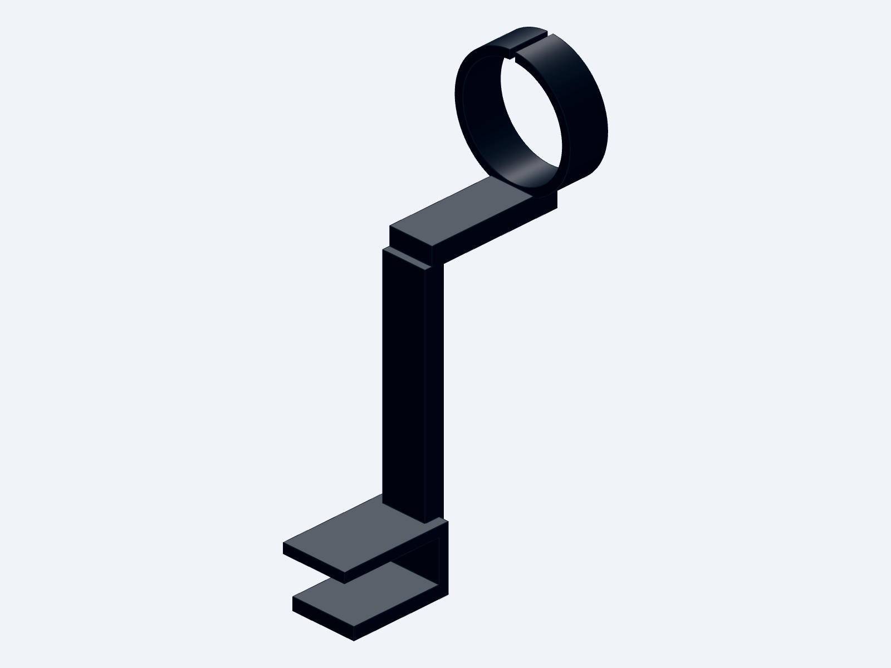

# Microphone Desk Mount

Parametric snap-on desk-clamp holder for a 42 mm microphone (17 mm desk).



## Files

| File | Purpose |
|---|---|
| `mic_desk_mount.step.py` | Parametric generator (build123d) - edit this |
| `mic_desk_mount.step` | STEP model |
| `mic_desk_mount.stl` | Print-ready mesh |

Regenerate after edits:

```bash
python C:/Users/metzd/.codex/skills/cad/scripts/gen mic_desk_mount.step.py --write
python C:/Users/metzd/.codex/skills/cad/scripts/export mic_desk_mount.step.py --stl
```

## Key parameters (top of `mic_desk_mount.step.py`)

| Param | Default | Meaning |
|---|---|---|
| `DESK_T` | 17.0 | Desk thickness |
| `PRELOAD` | 0.8 | Spring interference on the desk (mouth = DESK_T - PRELOAD) |
| `MIC_D` / `RING_ID` | 42.0 / 41.9 | Mic diameter / cradle bore (0.1 interference) |
| `CRADLE_Y` / `CRADLE_Z` | 62 / 120 | Ring center: reach from desk edge / height above desktop |
| `SLIT_W` | 2.2 | Collet slit at ring top |

## Print & use

- Material: PETG or better; 4 perimeters, 25% gyroid, no supports needed.
- Print orientation: as modeled (clamp mouth down) - layer lines run across the column, the strongest direction for the opening force.
- Use: push the clamp onto the desk edge until the bottom jaw springs past, then press the mic straight down into the cradle; it snaps past the two inner lips. Twist to remove.
- If the grip is too tight/loose, adjust `PRELOAD` (+/-0.2) or `RING_ID` (+/-0.15).
