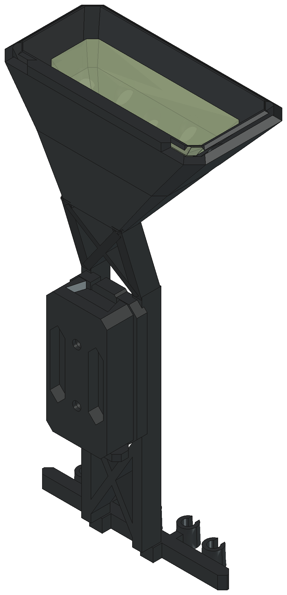

# Historical LIFT X quiver revision

**Superseded:** use [the left-hand MountV2 revision](MountV2/README.md) for the current model and [its print pack](MountV2/LiftX_LH_MountV2_Print_Pack.zip). The generator now writes to `MountV2/`. Everything below and the older STEP/STL/ZIP files are historical; their fit, rim and simulation claims do not qualify the current model. The earlier basket had crossing taper surfaces, and the old dock placed screw access behind its latch. Do not print the historical package as the current design.



This is a two-part, five-arrow quick-detach quiver: one printed chassis contains the open basket, topology-informed FDM spine, five shaft clips, and male rail; one printed bow dock contains the female rail and integral latch. The chassis mesh is 126.0 × 66.7 × 248.0 mm, so it fits upright within a 256 mm cube with 8 mm of nominal Z margin.

The dock uses a generic 10-24 accessory pattern at 33.325 mm / 1.312 in centers. It is not a dimensional copy of Mathews’ unpublished LowPro triangular-window receiver. Verify the actual bow, sight, rest, cables, screws, and riser clearances before use.

## What was refined

- Replaced the former tall hollow basket wedge and separate-looking bottom with one closed, multi-station boat shell.
- Made the basket top fully open and kept the perimeter rim continuous.
- Reduced the basket’s lower footprint to a 38 × 12 mm rear keel seated directly across both spine chords; the keel expands gradually into the full shell.
- Fused each 6 × 12 mm spine chord directly into the basket floor/wall and added two internal load-spreading ribs below the rim—no connector tabs, collars, or hardware.
- Left only five intentional tapered shaft ports in the closed basket floor.
- Replaced the lower wishbone network with one chamfered carrier, five tapered C-clips, two chord-aligned roots, and short local necks where required.
- Kept two deep X-braced spine bays with 6 mm chords, 4 mm diagonals, and a 12 mm print depth.
- Simplified the chassis mount and dock into coherent chamfered plates while preserving the calibrated rail, latch, and clearance surfaces.

## Exact release data

| Item | Value |
|---|---:|
| Chassis STL envelope | 126.0 × 66.7 × 248.0 mm |
| Bow dock envelope | 38.0 × 24.6 × 80.0 mm |
| Chassis CAD volume | 132.0 cm³ |
| Bow dock CAD volume | 28.4 cm³ |
| Total solid CAD volume | 160.5 cm³ |
| Fully solid PETG estimate | ~205 g at 1.28 g/cm³ |
| Printed production parts | 2 |
| Arrow capacity | 5 |
| Nominal shaft diameter | 6.5 mm, parametric |

Actual sliced mass depends on walls and infill; use Bambu Studio’s result for purchasing and production planning.

## Bambu Lab A1 print setup

Chassis baseline:

- Use dried PETG-HF, a 0.4 mm nozzle, and 0.20 mm layers.
- Print upright exactly as exported with the lower shaft rail on the build plate.
- Start with 5 wall loops, 6 top/bottom layers, 35% gyroid, and a 12–15 mm brim.
- Print one chassis at a time and avoid high-acceleration modes on the tall part.
- Use build-plate-only organic/tree supports after inspecting the slice. The spine bays and gradual basket flare are self-supporting by design, but the model still has 3,667 mm² of downward mesh area steeper than 45°; do not claim or assume a support-free print.
- Keep support interfaces away from the dovetail, latch notch, clip throats, and arrow ports.

Dock baseline:

- Print separately on its largest stop/plate face using the same layer and wall settings.
- Keep support out of the female dovetail and latch flexure.
- Print a clearance coupon or three `DOCK_CLEARANCE` variants before forcing assembly.

Do not use PLA for a quiver that may sit in a hot vehicle. PETG-HF still needs heat-soak, UV, vibration, and fatigue testing.

## Deterministic release checks

- Harness STEP validation: chassis PASS; dock PASS; isolated basket diagnostic PASS.
- Production shapes: exactly one valid positive-volume solid per printed part.
- Chassis STL: watertight, 17,990 facets.
- STL/CAD volume difference: 0.0025%.
- Latched chassis/dock hard interference: 0.000 mm³.
- Foam/chassis hard interference: 0.000 mm³.
- Five basket port probes: fully open.
- Five lower clip bore probes: fully open.
- Direct basket-root probes: 562 mm³ material at each chord location.
- Harness diff confirms topology and geometry changed from the pre-refinement baseline.

## Structural screening

The exact release chassis was meshed with Gmsh into 16,107 C3D4 tetrahedra and screened with CalculiX using an elastic modulus of 2,050 MPa and assumed Poisson ratio 0.38. Loads act on the rear basket load band; 167 bow-side mount nodes are fixed.

| Load case | Loaded displacement | 95th-percentile von Mises |
|---|---:|---:|
| 250 N upper lateral | 3.46 mm | 8.17 MPa |
| 250 N upper fore-aft | 20.98 mm | 25.79 MPa |
| 150 N lower lateral | 2.39 mm | 3.78 MPa |
| 12 N·m mount moment | 4.05 mm | 5.24 MPa |

These are linear-elastic comparative screens, not proof loads or printed-part allowables. Printed anisotropy, creep, impact, temperature, boundary conditions, and real arrow/bow loads require physical correlation.

## Files

- `LiftX_Quiver.FCStd` — colored assembly with arrows and foam references
- `LiftX_Quiver_No_Arrows.FCStd` — unloaded product-review assembly
- `STEP/LiftX_Quiver_Assembly.step` — neutral assembly CAD
- `STEP/quiver_chassis_petg.step` — primary chassis STEP
- `STEP/bow_dock_petg.step` — primary dock STEP
- `STL/*.stl` — upright production meshes
- `3MF/*.3mf` — current slicer imports derived from release STEP files
- `lift_x_quiver_generator.py` — canonical parametric FreeCAD/OCC source
- `CAD_BRIEF.md` — design intent and release gates
- `Review/RELEASE_REVIEW.md` — audit evidence and limitations
- `Simulation/solid_spine_fea.py` / `solid_fea_results.json` — reproducible screening model/results
- `Simulation/spine_topology_optimization.py` — earlier same-volume topology study
- `LiftX_Quiver_Print_Pack.zip` — packaged handoff

## Qualification before field use or 10,000 units

Measure the actual LIFT X interface, then verify screw engagement, sight/rest/cable clearance, rail fit, latch cycling, arrow retention, broadhead containment, shot vibration, impact, hot-car exposure, UV/moisture conditioning, and fatigue. Pilot with instrumented printed samples before selecting injection molding, MJF/SLS, or a printer-farm process. Do not drill or refinish the bow.

## Regenerate

```powershell
& 'C:\Program Files\FreeCAD 1.1\bin\freecadcmd.exe' '.\Quiver\LiftX\lift_x_quiver_generator.py'
python '.\Quiver\LiftX\Simulation\solid_spine_fea.py' 'compact_fdm=.\Quiver\LiftX\STEP\quiver_chassis_petg.step'
```
