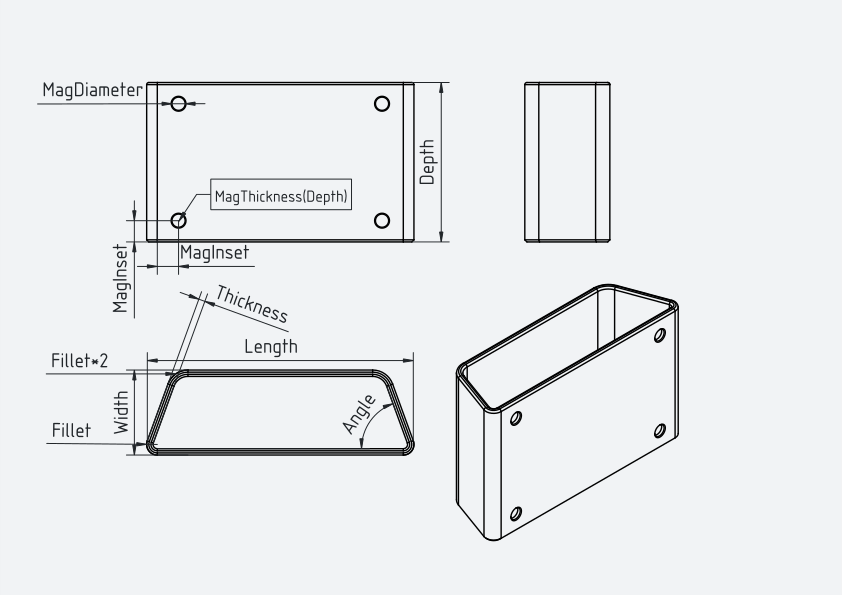

# 🛠️ FreeCAD Designs

> A collection of my 3D models designed in [FreeCAD](https://www.freecad.org/) — ready to view, remix, and print.


[](https://www.apache.org/licenses/LICENSE-2.0)


---

## 📦 Models

### 🥤 Fridge Cup

<p align="center">
  
</p>

A magnet-mounted holder that sticks to the side of your fridge like an oversized fridge magnet — drop in pens, utensils, or anything else you want within reach. Press four neodymium magnets into the pockets on the back face and it'll hang flat against any ferrous surface. Fully parametric FreeCAD model with variables exposed for every dimension, so you can resize the height, width, depth, wall thickness, fillets, and trapezoidal base angle without rebuilding the geometry.

| | |
|---|---|
| **Source file** | [`Fridge Cup.FCStd`](Fridge%20Cup/Fridge%20Cup.FCStd) |
| **Print-ready** | [`Fridge Cup.3mf`](Fridge%20Cup/Fridge%20Cup.3mf) |
| **License** | [LICENSE](Fridge%20Cup/LICENSE) |

#### Dimensions

<p align="center">
  
</p>

#### Parameters (`VarSet`)

Open the `VarSet` in the FreeCAD model tree to edit any of these — the geometry rebuilds automatically.

| Variable | Default | Unit | Drives |
|---|---:|---|---|
| `Length` | 100 | mm | Outer footprint length (sketch constraint) |
| `Width` | 30 | mm | Outer footprint width (sketch constraint) |
| `Depth` | 75 | mm | Cup height / pad extrusion depth |
| `Thickness` | 3 | mm | Wall thickness (shell) |
| `Fillet` | 5 | mm | Vertical corner fillet radius (top edge uses 2 × `Fillet`) |
| `MagDiameter` | 6.2 | mm | Magnet pocket diameter |
| `MagThickness` | 2 | mm | Magnet pocket depth |
| `MagInset` | 10 | mm | Magnet inset from each corner |
| `Angle` | 60 | ° | Base angle of the trapezoidal bottom face |

#### Printing Notes

- **Orientation:** print with the bottom (closed) face down. This puts the open top facing up and avoids the need for any supports.
- **Magnets:** four 6 × 2 mm neodymium discs press-fit into the back-face pockets. In testing, this hold strength was *just barely* enough to support two full-size dry erase markers without slipping — for anything heavier, increase `MagDiameter` / `MagThickness` and use stronger magnets.

---

## 🖥️ Opening the Files

1. Install [FreeCAD](https://www.freecad.org/downloads.php) (free & open source).
2. Clone this repo:
   ```bash
   git clone https://github.com/DevanMetz/Devan-Metz-FreeCAD.git
   ```
3. Open any `.FCStd` file in FreeCAD to view, edit, or remix the design.

## 🖨️ 3D Printing

`.3mf` files are ready to slice in [PrusaSlicer](https://www.prusa3d.com/page/prusaslicer_424/), [Bambu Studio](https://bambulab.com/en/download/studio), [OrcaSlicer](https://github.com/SoftFever/OrcaSlicer), or [Cura](https://ultimaker.com/software/ultimaker-cura/).

---

## 📜 License

Released under the [Apache License 2.0](https://www.apache.org/licenses/LICENSE-2.0). You're free to use, modify, and distribute these designs — including for commercial purposes — provided you retain the license and attribution notices.

---

<p align="center"><sub>Built with ❤️ and FreeCAD</sub></p>
