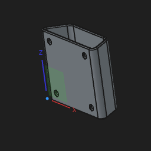

# 🛠️ FreeCAD Designs

> A collection of my 3D models designed in [FreeCAD](https://www.freecad.org/) — ready to view, remix, and print.


---

## 📦 Models

### 🥤 Fridge Cup

<p align="center">
  
</p>

A compact, slim-profile cup designed to fit neatly in a fridge door — perfect for saving space.

| | |
|---|---|
| **Source file** | [`Fridge Cup.FCStd`](Fridge%20Cup/Fridge%20Cup.FCStd) |
| **Print-ready** | [`Fridge Cup.3mf`](Fridge%20Cup/Fridge%20Cup.3mf) |
| **License** | [LICENSE](Fridge%20Cup/LICENSE) |

---

## 🖥️ Opening the Files

1. Install [FreeCAD](https://www.freecad.org/downloads.php) (free & open source).
2. Clone this repo:
   ```bash
   git clone https://github.com/DevanMBio/FreeCAD.git
   ```
3. Open any `.FCStd` file in FreeCAD to view, edit, or remix the design.

## 🖨️ 3D Printing

`.3mf` files are ready to slice in [PrusaSlicer](https://www.prusa3d.com/page/prusaslicer_424/), [Bambu Studio](https://bambulab.com/en/download/studio), [OrcaSlicer](https://github.com/SoftFever/OrcaSlicer), or [Cura](https://ultimaker.com/software/ultimaker-cura/).

---

## 📜 License

Each model includes its own `LICENSE` file — please check before redistributing or selling prints.

---

<p align="center"><sub>Built with ❤️ and FreeCAD</sub></p>
