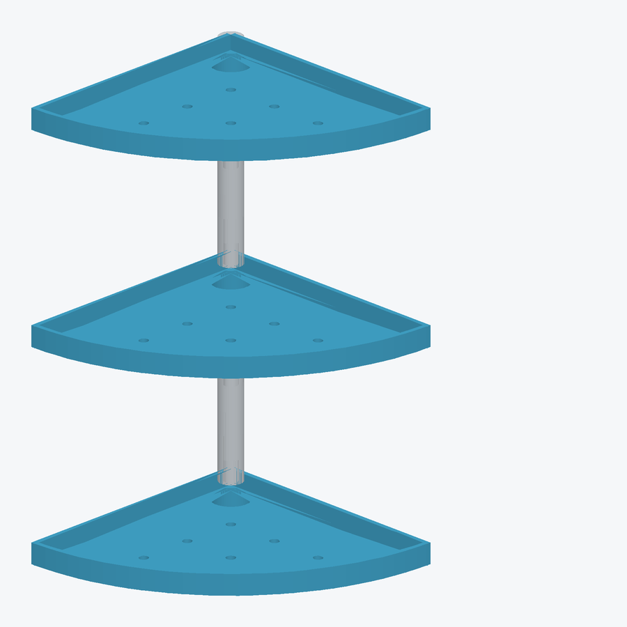
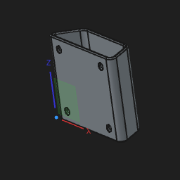
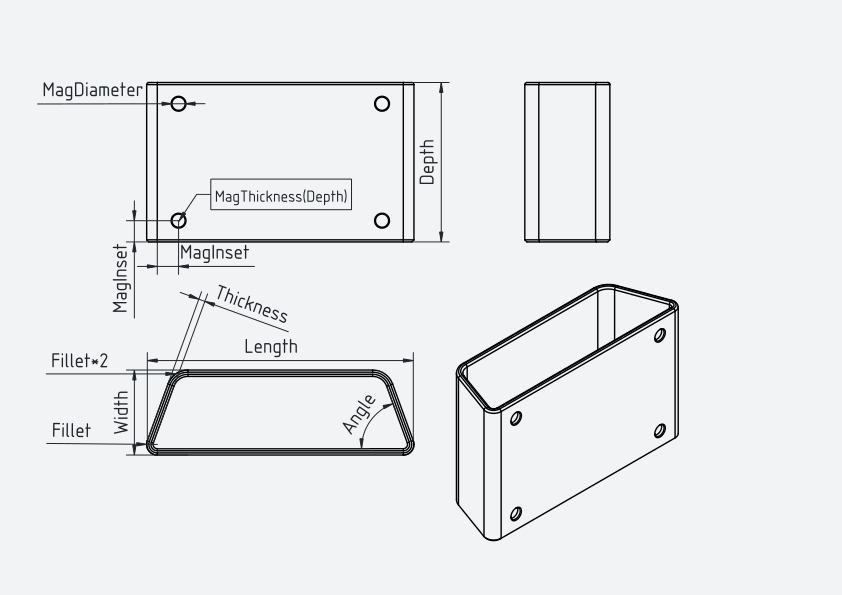

# 🛠️ FreeCAD Designs

> A collection of my 3D models designed in [FreeCAD](https://www.freecad.org/) — ready to view, remix, and print.


[](https://www.apache.org/licenses/LICENSE-2.0)


---

## 📦 Models

### Everyday Prints

Forty-seven original parametric print files: a divided parts tray,
desk-edge cable comb, drawer-divider foot and fit coupon, phone stand, corner
square, handle marking jig, tube squeezer, two-piece draining soap dish,
leaning label stand, finishing pyramid, cord winder, and hex-bit rack with a
matching fit coupon, sanding block with wedges, desk cable grommet, and
corner-radius template, center-finding jig, brush rest, utility peg, and
sliding-lid parts box with matching fit samples, round-stock cradle,
cable-tie anchor, workshop funnel, folded-bag clip, cord clip, hex-nut hand knob,
slotted spacing shim, 90°/45° marking saddle, roll-core adapter, braced bookend,
corner cable guide, small-parts scoop, plant marker, and adjustable ruler stop
with a matching wedge, smooth-tube reducer, socket fit ring, and strap-clamp
corner pad with a four-pad assembly reference, and a sorting sieve with an
aperture coupon, plus a modular cross/T/corner/straight drawer-divider joint
and its board-fit reference assembly.
Includes editable build123d Python source,
STEP, STL, geometry-only 3MF, and geometry/mesh validation reports.

[Browse the designs and printing instructions](Everyday%20Prints/README.md).
[Visual model index](Everyday%20Prints/index.html) · [Image index for GitHub](Everyday%20Prints/INDEX.md).
[Customize and download in your browser](https://everyday-prints.metzdevan.workers.dev) · [Cloudflare app source](Everyday%20Prints/cloud/README.md).
Physical print testing is pending.

Use the standalone [PrintCAD Brief](CAD%20Print%20Planner/index.html) to plan
dimensions, fit coupons, corner treatments, and physical print revisions before
starting a model.

### Bathroom Corner Shelf

<p align="center">
  
</p>

A three-tier countertop organizer built around one 8 x 300 mm carbon-fiber
rod. Each quarter-circle tray reaches 185 mm along both walls and includes
drain holes, retaining lips, constant-thickness chamfered front corners, and a
rounded rear corner for caulk or grout clearance.

| | |
|---|---|
| **Source file** | [`Bathroom Corner Shelf.FCStd`](Bathroom%20Corner%20Shelf/Bathroom%20Corner%20Shelf.FCStd) |
| **Build script** | [`make_corner_shelf.py`](Bathroom%20Corner%20Shelf/make_corner_shelf.py) |
| **Print-ready** | [`shelf.stl`](Bathroom%20Corner%20Shelf/shelf.stl) · [`spacer.stl`](Bathroom%20Corner%20Shelf/spacer.stl) · [`top_cap.stl`](Bathroom%20Corner%20Shelf/top_cap.stl) |
| **Instructions** | [Printing and assembly](Bathroom%20Corner%20Shelf/README.md) |

#### Dimensions

| Dimension | Value |
|---|---:|
| Shelf wall length | 185 mm |
| Tier spacing | 140 mm |
| Shelf plate / retaining wall | 4 mm / 3 mm |
| Retaining lip height | 14 mm |
| Rod | 8 x 300 mm |
| Rod hole diameter | 8.1 mm |

#### Print and Assembly

- Print three shelves, four spacers, and one top cap.
- PETG, four walls, and 20% infill are recommended for normal bathroom items.
- Slide the parts onto the rod in the order shown in the [assembly instructions](Bathroom%20Corner%20Shelf/README.md).

---

### 🥤 Fridge Cup

<p align="center">
  
</p>

A magnet-mounted holder that sticks to the side of your fridge like an oversized fridge magnet — drop in pens, utensils, or anything else you want within reach. Press four neodymium magnets into the pockets on the back face and it'll hang flat against any ferrous surface. Fully parametric FreeCAD model with variables exposed for every dimension, so you can resize the height, width, depth, wall thickness, fillets, and trapezoidal base angle without rebuilding the geometry.

| | |
|---|---|
| **Source file** | [`Fridge Cup.FCStd`](Fridge%20Cup/Fridge%20Cup.FCStd) |
| **Print-ready** | [`Fridge Cup.3mf`](Fridge%20Cup/Fridge%20Cup.3mf) |
| **License** | [LICENSE](Fridge%20Cup/LICENSE) |

#### Dimensions

<p align="center">
  
</p>

#### Parameters (`VarSet`)

Open the `VarSet` in the FreeCAD model tree to edit any of these — the geometry rebuilds automatically.

| Variable | Default | Unit | Drives |
|---|---:|---|---|
| `Length` | 100 | mm | Outer footprint length (sketch constraint) |
| `Width` | 30 | mm | Outer footprint width (sketch constraint) |
| `Depth` | 75 | mm | Cup height / pad extrusion depth |
| `Thickness` | 3 | mm | Wall thickness (shell) |
| `Fillet` | 5 | mm | Vertical corner fillet radius (top edge uses 2 × `Fillet`) |
| `MagDiameter` | 6.2 | mm | Magnet pocket diameter |
| `MagThickness` | 2 | mm | Magnet pocket depth |
| `MagInset` | 10 | mm | Magnet inset from each corner |
| `Angle` | 60 | ° | Base angle of the trapezoidal bottom face |

#### Printing Notes

- **Orientation:** print with the bottom (closed) face down. This puts the open top facing up and avoids the need for any supports.
- **Magnets:** four 6 × 2 mm neodymium discs press-fit into the back-face pockets. In testing, this hold strength was *just barely* enough to support two full-size dry erase markers without slipping — for anything heavier, increase `MagDiameter` / `MagThickness` and use stronger magnets.

---

## 🖥️ Opening the Files

1. Install [FreeCAD](https://www.freecad.org/downloads.php) (free & open source).
2. Clone this repo:
   ```bash
   git clone https://github.com/DevanMetz/Devan-Metz-FreeCAD.git
   ```
3. Open any `.FCStd` file in FreeCAD to view, edit, or remix the design.

## 🖨️ 3D Printing

`.3mf` and `.stl` files are ready to slice in [PrusaSlicer](https://www.prusa3d.com/page/prusaslicer_424/), [Bambu Studio](https://bambulab.com/en/download/studio), [OrcaSlicer](https://github.com/SoftFever/OrcaSlicer), or [Cura](https://ultimaker.com/software/ultimaker-cura/).

---

## 📜 License

Released under the [Apache License 2.0](https://www.apache.org/licenses/LICENSE-2.0). You're free to use, modify, and distribute these designs — including for commercial purposes — provided you retain the license and attribution notices.

---

<p align="center"><sub>Built with ❤️ and FreeCAD</sub></p>
